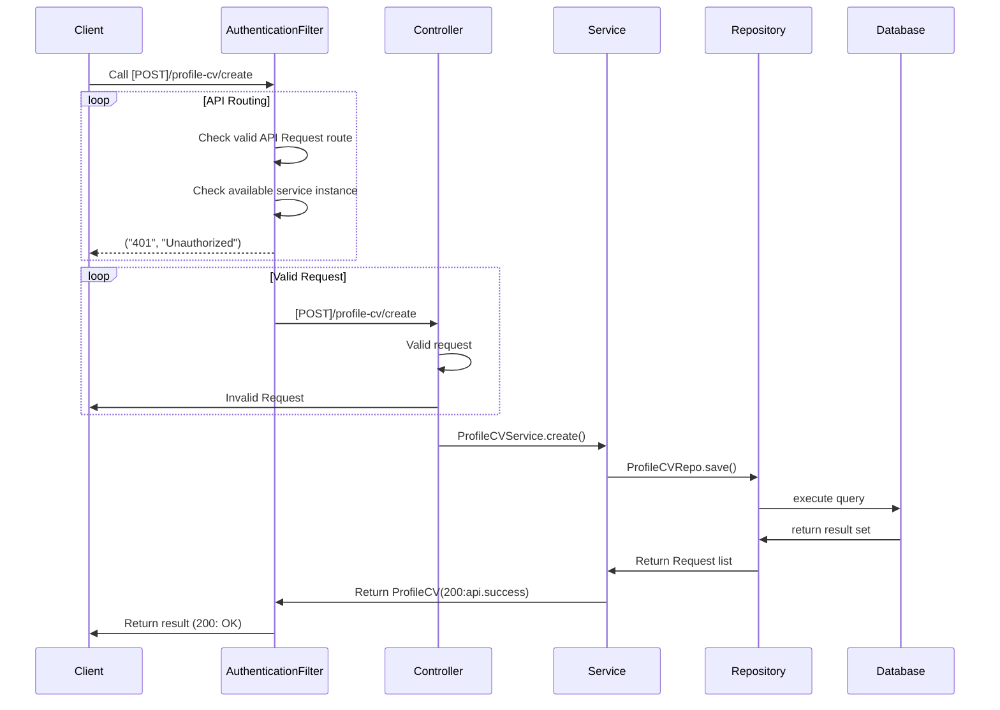

# CREATE PROFILE CV API

### Sequence Diagram

```mermaid
sequenceDiagram
    participant Client
    participant AuthenticationFilter
    participant Controller
    participant Service
    participant Repository
    participant Database
    Client->>AuthenticationFilter: Call [POST]/profile-cv/create
    
    loop API Routing
    	AuthenticationFilter->>AuthenticationFilter: Check valid API Request route
        AuthenticationFilter->>AuthenticationFilter: Check available service instance
        AuthenticationFilter-->>Client: ("401", "Unauthorized")
    end
    loop Valid Request
    	AuthenticationFilter->>Controller: [POST]/profile-cv/create
    	Controller->>Controller: Valid request
    	Controller->>Client: Invalid Request
    end
    
    
    Controller->>Service: ProfileCVService.create();
    
    Service->>Repository: ProfileCVRepo.save()
    Repository->>Database: execute query
    Database->>Repository: return result set
    Repository->>Service: Return Request list
    Service->>AuthenticationFilter: Return ProfileCV(200:api.success)
    AuthenticationFilter->>Client: Return result (200: OK)
    
```

