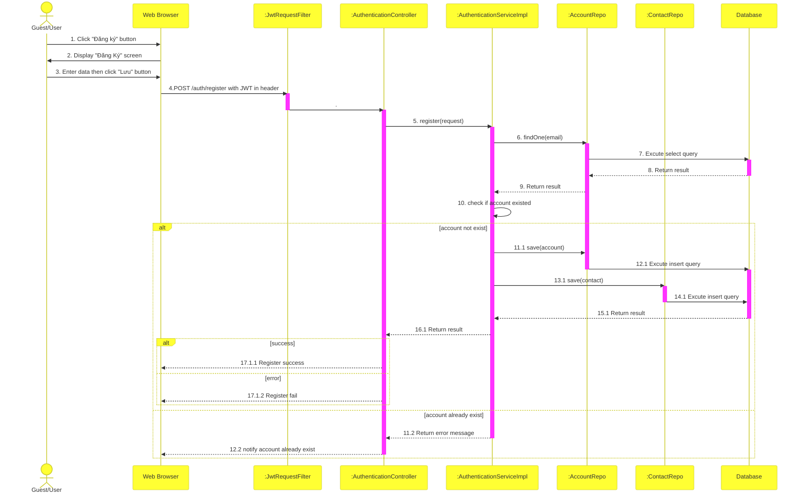
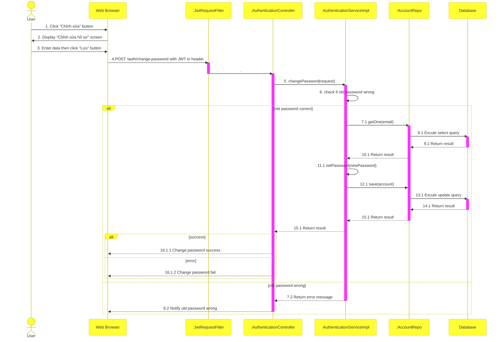

```mermaid


 
sequenceDiagram
 %%{init: {'theme': 'base', 'themeVariables': {'primaryColor': '#FFFF33'}}}%%
    actor Guest/User
    participant Web Browser
    participant #58;JwtRequestFilter    
    participant #58;AuthenticationController
    participant #58;AuthenticationServiceImpl
    participant #58;AccountRepo
    participant #58;ContactRepo
    participant Database
    Guest/User->>Web Browser: 1. Click "Đăng ký" button
    Web Browser->>Guest/User:2. Display "Đăng Ký" screen
    Guest/User->>Web Browser:3. Enter data then click "Lưu" button
   
    Web Browser->>#58;JwtRequestFilter: 4.POST /auth/register with JWT in header
     activate #58;JwtRequestFilter
    #58;JwtRequestFilter->>#58;AuthenticationController: .
    deactivate #58;JwtRequestFilter
    activate #58;AuthenticationController	
	#58;AuthenticationController->>#58;AuthenticationServiceImpl:5. register(request)	
	activate #58;AuthenticationServiceImpl
    #58;AuthenticationServiceImpl->>#58;AccountRepo:6. findOne(email)
    activate #58;AccountRepo
    #58;AccountRepo->>Database:7. Excute select query
    activate Database
    Database-->>#58;AccountRepo:8. Return result
    deactivate Database
    #58;AccountRepo-->>#58;AuthenticationServiceImpl:9. Return result
    #58;AuthenticationServiceImpl->>#58;AuthenticationServiceImpl:10. check if account existed
alt account not exist
		#58;AuthenticationServiceImpl->>#58;AccountRepo: 11.1 save(account)
		#58;AccountRepo->>Database: 12.1 Excute insert query
		deactivate #58;AccountRepo
        activate Database
		#58;AuthenticationServiceImpl->>#58;ContactRepo: 13.1 save(contact)
		activate #58;ContactRepo		
		#58;ContactRepo->>Database:14.1 Excute insert query
		deactivate #58;ContactRepo
		Database-->>#58;AuthenticationServiceImpl:15.1 Return result
		deactivate Database
		#58;AuthenticationServiceImpl-->>#58;AuthenticationController:16.1 Return result
	alt success
		#58;AuthenticationController-->>Web Browser:17.1.1 Register success
	else error
		#58;AuthenticationController-->>Web Browser:17.1.2 Register fail        
	end
else account already exist
		#58;AuthenticationServiceImpl-->>#58;AuthenticationController:11.2 Return error message
		deactivate #58;AuthenticationServiceImpl
		#58;AuthenticationController-->>Web Browser:12.2 notify account already exist
		deactivate #58;AuthenticationController
end
```

```mermaid


 
sequenceDiagram
 %%{init: {'theme': 'base', 'themeVariables': {'primaryColor': '#FFFF33'}}}%%
    actor User
    participant Web Browser
    participant #58;JwtRequestFilter    
    participant #58;AuthenticationController
    participant #58;AuthenticationServiceImpl
    participant #58;AccountRepo
    participant Database
    User->>Web Browser: 1. Click "Chỉnh sửa" button
    Web Browser->>User:2. Display "Chỉnh sửa hồ sơ" screen
    User->>Web Browser:3. Enter data then click "Lưu" button
   
    Web Browser->>#58;JwtRequestFilter: 4.POST /auth/change-password with JWT in header
     activate #58;JwtRequestFilter
    #58;JwtRequestFilter->>#58;AuthenticationController: .
    deactivate #58;JwtRequestFilter
    activate #58;AuthenticationController	
	#58;AuthenticationController->>#58;AuthenticationServiceImpl:5. changePassword(request)
	activate #58;AuthenticationServiceImpl
    #58;AuthenticationServiceImpl->>#58;AuthenticationServiceImpl:6. check if old password wrong
    alt old password correct	
    #58;AuthenticationServiceImpl->>#58;AccountRepo:7.1 getOne(email)
    activate #58;AccountRepo
    #58;AccountRepo->>Database:8.1 Excute select query
    activate Database
    Database-->>#58;AccountRepo:9.1 Return result
    deactivate Database
    #58;AccountRepo-->>#58;AuthenticationServiceImpl:10.1 Return result	
	#58;AuthenticationServiceImpl->>#58;AuthenticationServiceImpl: 11.1 setPassword(newPassword)
	#58;AuthenticationServiceImpl->>#58;AccountRepo: 12.1 save(account)	
	#58;AccountRepo->>Database:13.1 Excute update query
	activate Database
	Database-->>#58;AccountRepo:14.1 Return result
    deactivate Database
	#58;AccountRepo-->>#58;AuthenticationServiceImpl:15.1 Return result
	deactivate #58;AccountRepo	
	#58;AuthenticationServiceImpl-->>#58;AuthenticationController:15.1 Return result
	alt success
	#58;AuthenticationController-->>Web Browser:16.1.1 Change password success	
	else error		
	#58;AuthenticationController-->>Web Browser:16.1.2 Change password fail	
	end
else old password wrong
	#58;AuthenticationServiceImpl-->>#58;AuthenticationController:7.2 Return error message
	deactivate #58;AuthenticationServiceImpl
	#58;AuthenticationController-->>Web Browser:8.2 Notify old password wrong
	deactivate #58;AuthenticationController
end
```

end
