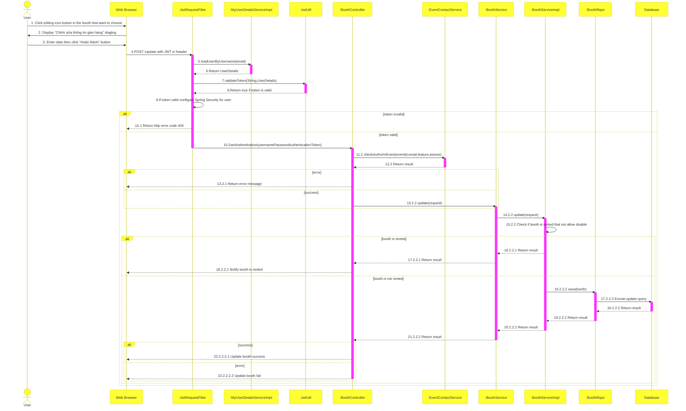
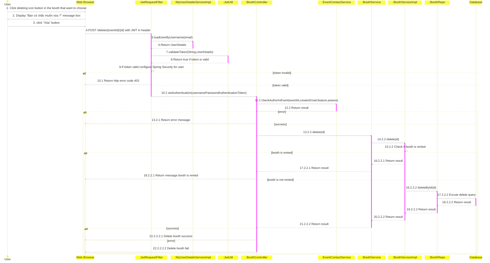
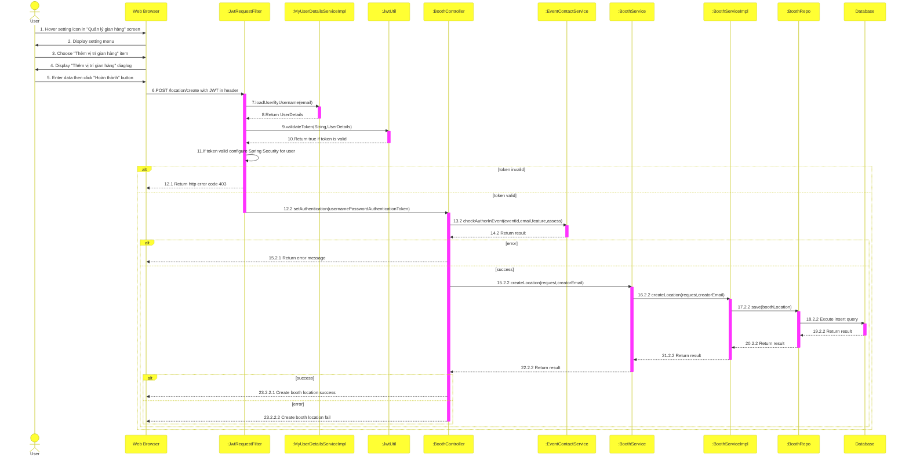
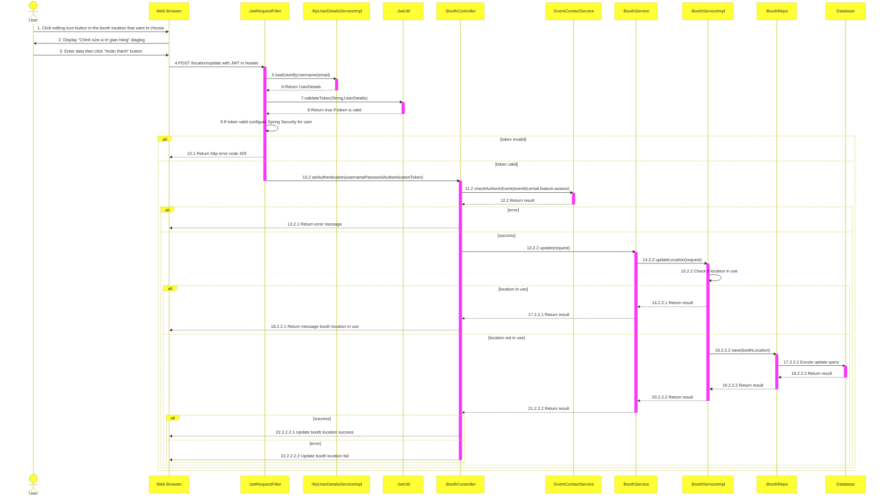
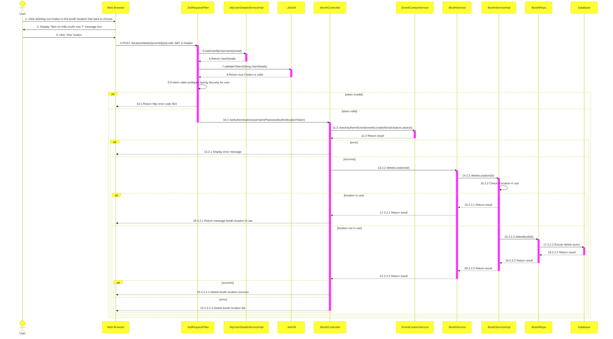

Create Booth

```mermaid
%%{init: {'theme': 'base', 'themeVariables': {'primaryColor': '#FFFF33'}}}%%
sequenceDiagram
    actor User
    participant Web Browser
    participant #58;JwtRequestFilter
    participant #58;MyUserDetailsServiceImpl
    participant #58;JwtUtil
    participant #58;BoothController
    participant #58;EventContactService    
    participant #58;BoothService
    participant #58;BoothServiceImpl
    participant #58;BoothRepo
    participant Database
    User->>Web Browser: 1. Hover setting icon in "Quản lý gian hàng" screen
    Web Browser->>User: 2. Display setting menu 
    User->>Web Browser: 3. Choose "Thêm gian hàng" item
    Web Browser->>User: 4. Display "Thêm gian hàng" diaglog
    User->>Web Browser: 5. Enter data then click "Hoàn thành" button    
    Web Browser->>#58;JwtRequestFilter: 6.POST /create with JWT in header
    activate #58;JwtRequestFilter
    #58;JwtRequestFilter->>#58;MyUserDetailsServiceImpl: 7.loadUserByUsername(email)
    activate #58;MyUserDetailsServiceImpl
    #58;MyUserDetailsServiceImpl-->>#58;JwtRequestFilter: 8.Return UserDetails
    deactivate #58;MyUserDetailsServiceImpl
    #58;JwtRequestFilter->>#58;JwtUtil: 9.validateToken(String,UserDetails)
    activate #58;JwtUtil
    #58;JwtUtil-->>#58;JwtRequestFilter: 10.Return true if token is valid
    deactivate #58;JwtUtil
    #58;JwtRequestFilter->>#58;JwtRequestFilter: 11.If token valid configure Spring Security for user 
    alt token invalid
    #58;JwtRequestFilter-->>Web Browser:12.1 Return http error code 403
    else token valid
    #58;JwtRequestFilter->>#58;BoothController: 12.2 setAuthentication(usernamePasswordAuthenticationToken);
    deactivate #58;JwtRequestFilter     
    activate #58;BoothController
    #58;BoothController->>#58;EventContactService: 13.2 checkAuthorInEvent(eventId,email,feature,assess);
    activate #58;EventContactService   
    #58;EventContactService-->>#58;BoothController:14.2 Return result
    deactivate #58;EventContactService
    alt error
		#58;BoothController-->>Web Browser: 15.2.1 Return error message
	else success		
    #58;BoothController->>#58;BoothService: 15.2.2 create(request,creatorEmail);
    activate #58;BoothService    
       
    #58;BoothService->>#58;BoothServiceImpl: 16.2.2 create(request,creatorEmail);
    activate #58;BoothServiceImpl
    #58;BoothServiceImpl->>#58;BoothRepo: 17.2.2 save(booth);
    activate #58;BoothRepo
    #58;BoothRepo->>Database: 18.2.2 Excute insert query    
    activate Database
    Database-->>#58;BoothRepo: 19.2.2 Return result    
    deactivate Database
    #58;BoothRepo-->>#58;BoothServiceImpl: 20.2.2 Return result
    deactivate #58;BoothRepo
    #58;BoothServiceImpl-->>#58;BoothService: 21.2.2 Return result
    deactivate #58;BoothServiceImpl
    #58;BoothService-->>#58;BoothController: 22.2.2 Return result
    deactivate #58;BoothService
    alt success
		#58;BoothController-->>Web Browser: 23.2.2.1 Create booth success
	else error
		#58;BoothController-->>Web Browser: 23.2.2.2 Create booth fail
		deactivate #58;BoothController
	end
	end
    end
	
	
```
Update Booth

```mermaid
%%{init: {'theme': 'base', 'themeVariables': { 'primaryColor': '#FFFF33'}}}%%
sequenceDiagram
    actor User
    participant Web Browser
    participant #58;JwtRequestFilter
    participant #58;MyUserDetailsServiceImpl
    participant #58;JwtUtil
    participant #58;BoothController
    participant #58;EventContactService
    participant #58;BoothService
    participant #58;BoothServiceImpl
    participant #58;BoothRepo
    participant Database
    User->>Web Browser: 1. Click editing icon button in the booth that want to choose    
    Web Browser->>User: 2. Display "Chỉnh sửa thông tin gian hàng" diaglog
    User->>Web Browser: 3. Enter data then click "Hoàn thành" button    
    Web Browser->>#58;JwtRequestFilter: 4.POST /update with JWT in header
    activate #58;JwtRequestFilter
    #58;JwtRequestFilter->>#58;MyUserDetailsServiceImpl: 5.loadUserByUsername(email)
    activate #58;MyUserDetailsServiceImpl
    #58;MyUserDetailsServiceImpl-->>#58;JwtRequestFilter: 6.Return UserDetails
    deactivate #58;MyUserDetailsServiceImpl
    #58;JwtRequestFilter->>#58;JwtUtil: 7.validateToken(String,UserDetails)
    activate #58;JwtUtil
    #58;JwtUtil-->>#58;JwtRequestFilter: 8.Return true if token is valid
    deactivate #58;JwtUtil
    #58;JwtRequestFilter->>#58;JwtRequestFilter: 9.If token valid configure Spring Security for user
     alt token invalid
    #58;JwtRequestFilter-->>Web Browser:10.1 Return http error code 403
    else token valid
    #58;JwtRequestFilter->>#58;BoothController: 10.2setAuthentication(usernamePasswordAuthenticationToken);
   
    deactivate #58;JwtRequestFilter     
    activate #58;BoothController
    #58;BoothController->>#58;EventContactService: 11.2 checkAuthorInEvent(eventId,email,feature,assess);
    activate #58;EventContactService     
    #58;EventContactService-->>#58;BoothController:12.2 Return result
    deactivate #58;EventContactService
    alt error
		#58;BoothController-->>Web Browser: 13.2.1 Return error message
	else success		
    #58;BoothController->>#58;BoothService: 13.2.2 update(request);
    activate #58;BoothService    
    end    
    #58;BoothService->>#58;BoothServiceImpl: 14.2.2 update(request);
    activate #58;BoothServiceImpl
    #58;BoothServiceImpl->>#58;BoothServiceImpl:15.2.2 Check if booth is rented that not allow disable
    alt booth is rented
		#58;BoothServiceImpl-->>#58;BoothService: 16.2.2.1 Return result
		#58;BoothService-->>#58;BoothController: 17.2.2.1 Return result
		#58;BoothController-->>Web Browser: 18.2.2.1 Notify booth is rented 
	else booth is not rented
    #58;BoothServiceImpl->>#58;BoothRepo: 16.2.2.2 save(booth);
    
    activate #58;BoothRepo
    #58;BoothRepo->>Database: 17.2.2.2 Excute update query    
    activate Database
    Database-->>#58;BoothRepo: 18.2.2.2 Return result    
    deactivate Database
    #58;BoothRepo-->>#58;BoothServiceImpl: 19.2.2.2 Return result
    deactivate #58;BoothRepo
    #58;BoothServiceImpl-->>#58;BoothService: 20.2.2.2 Return result
    deactivate #58;BoothServiceImpl
    #58;BoothService-->>#58;BoothController: 21.2.2.2 Return result
    deactivate #58;BoothService
    alt success
		#58;BoothController-->>Web Browser: 22.2.2.2.1 Update booth success
	else error
		#58;BoothController-->>Web Browser: 22.2.2.2.2 Update booth fail
		deactivate #58;BoothController
	end
	end
	end
	
	
```
Delete Booth

```mermaid
%%{init: {'theme': 'base', 'fontSize': '50px', 'themeVariables': {'primaryColor': '#FFFF33'}}}%%
sequenceDiagram
    actor User
    participant Web Browser
    participant #58;JwtRequestFilter
    participant #58;MyUserDetailsServiceImpl
    participant #58;JwtUtil
    participant #58;BoothController
    participant #58;EventContactService
    participant #58;BoothService
    participant #58;BoothServiceImpl
    participant #58;BoothRepo
    participant Database
    User->>Web Browser: 1. Click deleting icon button in the booth that want to choose   
    Web Browser->>User: 2. Display "Bạn có chắc muốn xóa ?" message box
    User->>Web Browser: 3. click "Xóa" button    
    Web Browser->>#58;JwtRequestFilter: 4.POST /delete/{eventId}/{id} with JWT in header
    activate #58;JwtRequestFilter
    #58;JwtRequestFilter->>#58;MyUserDetailsServiceImpl: 5.loadUserByUsername(email)
    activate #58;MyUserDetailsServiceImpl
    #58;MyUserDetailsServiceImpl-->>#58;JwtRequestFilter: 6.Return UserDetails
    deactivate #58;MyUserDetailsServiceImpl
    #58;JwtRequestFilter->>#58;JwtUtil: 7.validateToken(String,UserDetails)
    activate #58;JwtUtil
    #58;JwtUtil-->>#58;JwtRequestFilter: 8.Return true if token is valid
    deactivate #58;JwtUtil
    #58;JwtRequestFilter->>#58;JwtRequestFilter: 9.If token valid configure Spring Security for user
    alt token invalid
    #58;JwtRequestFilter-->>Web Browser:10.1 Return http error code 403
    else token valid
    #58;JwtRequestFilter->>#58;BoothController: 10.2 setAuthentication(usernamePasswordAuthenticationToken);
    deactivate #58;JwtRequestFilter     
    activate #58;BoothController
    #58;BoothController->>#58;EventContactService: 11.2 checkAuthorInEvent(eventId,creatorEmail,feature,assess);
    activate #58;EventContactService    
    #58;EventContactService-->>#58;BoothController:12.2 Return result
    deactivate #58;EventContactService
    alt error
		#58;BoothController-->>Web Browser: 13.2.1 Return error message
	else success		
    #58;BoothController->>#58;BoothService: 13.2.2 delete(id);
    activate #58;BoothService       
    #58;BoothService->>#58;BoothServiceImpl: 14.2.2 delete(id);
    activate #58;BoothServiceImpl
    #58;BoothServiceImpl->>#58;BoothServiceImpl: 15.2.2 Check if booth is rented
    alt booth is rented
		#58;BoothServiceImpl-->>#58;BoothService: 16.2.2.1 Return resutl
		#58;BoothService-->>#58;BoothController: 17.2.2.1 Return resutl
		#58;BoothController-->>Web Browser: 18.2.2.1 Return message booth is rented
	else booth is not rented		
    #58;BoothServiceImpl->>#58;BoothRepo: 16.2.2.2 deleteById(id);
    activate #58;BoothRepo      
    #58;BoothRepo->>Database: 17.2.2.2 Excute delete query    
    activate Database
    Database-->>#58;BoothRepo: 18.2.2.2 Return result    
    deactivate Database
    #58;BoothRepo-->>#58;BoothServiceImpl: 19.2.2.2 Return result
    deactivate #58;BoothRepo
    #58;BoothServiceImpl-->>#58;BoothService: 20.2.2.2 Return result
    deactivate #58;BoothServiceImpl
    #58;BoothService-->>#58;BoothController: 21.2.2.2 Return result
    deactivate #58;BoothService
    alt success
		#58;BoothController-->>Web Browser: 22.2.2.2.1  Delete booth success
	else error
		#58;BoothController-->>Web Browser: 22.2.2.2.2  Delete booth fail
		deactivate #58;BoothController
	end
	end
	end
	end
```
Create Booth Location

```mermaid
%%{init: {'theme': 'base', 'themeVariables': { 'primaryColor': '#FFFF33'}}}%%
sequenceDiagram
    actor User
    participant Web Browser
    participant #58;JwtRequestFilter
    participant #58;MyUserDetailsServiceImpl
    participant #58;JwtUtil
    participant #58;BoothController
    participant #58;EventContactService    
    participant #58;BoothService
    participant #58;BoothServiceImpl
    participant #58;BoothRepo
    participant Database
    User->>Web Browser: 1. Hover setting icon in "Quản lý gian hàng" screen
    Web Browser->>User: 2. Display setting menu 
    User->>Web Browser: 3. Choose "Thêm vị trí gian hàng" item
    Web Browser->>User: 4. Display "Thêm vị trí gian hàng" diaglog
    User->>Web Browser: 5. Enter data then click "Hoàn thành" button    
    Web Browser->>#58;JwtRequestFilter: 6.POST /location/create with JWT in header
    activate #58;JwtRequestFilter
    #58;JwtRequestFilter->>#58;MyUserDetailsServiceImpl: 7.loadUserByUsername(email)
    activate #58;MyUserDetailsServiceImpl
    #58;MyUserDetailsServiceImpl-->>#58;JwtRequestFilter: 8.Return UserDetails
    deactivate #58;MyUserDetailsServiceImpl
    #58;JwtRequestFilter->>#58;JwtUtil: 9.validateToken(String,UserDetails)
    activate #58;JwtUtil
    #58;JwtUtil-->>#58;JwtRequestFilter: 10.Return true if token is valid
    deactivate #58;JwtUtil
    #58;JwtRequestFilter->>#58;JwtRequestFilter: 11.If token valid configure Spring Security for user
    alt token invalid
    #58;JwtRequestFilter-->>Web Browser:12.1 Return http error code 403
    else token valid
    #58;JwtRequestFilter->>#58;BoothController: 12.2 setAuthentication(usernamePasswordAuthenticationToken);
    deactivate #58;JwtRequestFilter     
    activate #58;BoothController
    #58;BoothController->>#58;EventContactService: 13.2 checkAuthorInEvent(eventId,email,feature,assess);
    activate #58;EventContactService   
    #58;EventContactService-->>#58;BoothController:14.2 Return result
    deactivate #58;EventContactService
    alt error
		#58;BoothController-->>Web Browser: 15.2.1 Return error message
	else success		
    #58;BoothController->>#58;BoothService: 15.2.2 createLocation(request,creatorEmail);
    activate #58;BoothService        
    #58;BoothService->>#58;BoothServiceImpl: 16.2.2 createLocation(request,creatorEmail);
    activate #58;BoothServiceImpl
    #58;BoothServiceImpl->>#58;BoothRepo: 17.2.2 save(boothLocation);
    activate #58;BoothRepo
    #58;BoothRepo->>Database: 18.2.2 Excute insert query    
    activate Database
    Database-->>#58;BoothRepo: 19.2.2 Return result    
    deactivate Database
    #58;BoothRepo-->>#58;BoothServiceImpl: 20.2.2 Return result
    deactivate #58;BoothRepo
    #58;BoothServiceImpl-->>#58;BoothService: 21.2.2 Return result
    deactivate #58;BoothServiceImpl
    #58;BoothService-->>#58;BoothController: 22.2.2 Return result
    deactivate #58;BoothService
    alt success
		#58;BoothController-->>Web Browser: 23.2.2.1 Create booth location success
	else error
		#58;BoothController-->>Web Browser: 23.2.2.2 Create booth location fail
		deactivate #58;BoothController
	end
	end
	end
	
```
Update Booth Location

```mermaid
%%{init: {'theme': 'base', 'themeVariables': { 'primaryColor': '#FFFF33'}}}%%
sequenceDiagram
    actor User
    participant Web Browser
    participant #58;JwtRequestFilter
    participant #58;MyUserDetailsServiceImpl
    participant #58;JwtUtil
    participant #58;BoothController
    participant #58;EventContactService
    participant #58;BoothService
    participant #58;BoothServiceImpl
    participant #58;BoothRepo
    participant Database
    User->>Web Browser: 1. Click editing icon button in the booth location that want to choose    
    Web Browser->>User: 2. Display "Chỉnh sửa vị trí gian hàng" diaglog
    User->>Web Browser: 3. Enter data then click "Hoàn thành" button    
    Web Browser->>#58;JwtRequestFilter: 4.POST /location/update with JWT in header
    activate #58;JwtRequestFilter
    #58;JwtRequestFilter->>#58;MyUserDetailsServiceImpl: 5.loadUserByUsername(email)
    activate #58;MyUserDetailsServiceImpl
    #58;MyUserDetailsServiceImpl-->>#58;JwtRequestFilter: 6.Return UserDetails
    deactivate #58;MyUserDetailsServiceImpl
    #58;JwtRequestFilter->>#58;JwtUtil: 7.validateToken(String,UserDetails)
    activate #58;JwtUtil
    #58;JwtUtil-->>#58;JwtRequestFilter: 8.Return true if token is valid
    deactivate #58;JwtUtil
    #58;JwtRequestFilter->>#58;JwtRequestFilter: 9.If token valid configure Spring Security for user
    alt token invalid
    #58;JwtRequestFilter-->>Web Browser: 10.1 Return http error code 403
    else token valid
    #58;JwtRequestFilter->>#58;BoothController: 10.2 setAuthentication(usernamePasswordAuthenticationToken);
    deactivate #58;JwtRequestFilter     
    activate #58;BoothController
    #58;BoothController->>#58;EventContactService: 11.2 checkAuthorInEvent(eventId,email,feature,assess);
    activate #58;EventContactService    
    #58;EventContactService-->>#58;BoothController:12.2 Return result
    deactivate #58;EventContactService
    alt error
		#58;BoothController-->>Web Browser: 13.2.1 Return error message
	else success		
    #58;BoothController->>#58;BoothService: 13.2.2 update(request);
    activate #58;BoothService        
    #58;BoothService->>#58;BoothServiceImpl: 14.2.2 updateLocation(request);
    activate #58;BoothServiceImpl
    #58;BoothServiceImpl->>#58;BoothServiceImpl: 15.2.2 Check if location in use
    alt location in use
		#58;BoothServiceImpl-->>#58;BoothService: 16.2.2.1 Return resutl
		#58;BoothService-->>#58;BoothController: 17.2.2.1 Return resutl
		#58;BoothController-->>Web Browser: 18.2.2.1 Return message booth location in use
	else location not in use
    #58;BoothServiceImpl->>#58;BoothRepo: 16.2.2.2 save(boothLocation);
    activate #58;BoothRepo
    #58;BoothRepo->>Database: 17.2.2.2 Excute update query    
    activate Database
    Database-->>#58;BoothRepo: 18.2.2.2 Return result    
    deactivate Database
    #58;BoothRepo-->>#58;BoothServiceImpl: 19.2.2.2 Return result
    deactivate #58;BoothRepo
    #58;BoothServiceImpl-->>#58;BoothService: 20.2.2.2 Return result
    deactivate #58;BoothServiceImpl
    #58;BoothService-->>#58;BoothController: 21.2.2.2 Return result
    deactivate #58;BoothService
    alt success
		#58;BoothController-->>Web Browser: 22.2.2.2.1 Update booth location success
	else error
		#58;BoothController-->>Web Browser: 22.2.2.2.2 Update booth location fail
		deactivate #58;BoothController
	end
	end
	end
	end
	
	
```
Delete Booth Location

```mermaid
%%{init: {'theme': 'base', 'themeVariables': { 'primaryColor': '#FFFF33'}}}%%
sequenceDiagram
    actor User
    participant Web Browser
    participant #58;JwtRequestFilter
    participant #58;MyUserDetailsServiceImpl
    participant #58;JwtUtil
    participant #58;BoothController
    participant #58;EventContactService
    participant #58;BoothService
    participant #58;BoothServiceImpl
    participant #58;BoothRepo
    participant Database
    User->>Web Browser: 1. Click deleting icon button in the booth location that want to choose    
    Web Browser->>User: 2. Display "Bạn có chắc muốn xóa ?" message box
    User->>Web Browser: 3. click "Xóa" button    
    Web Browser->>#58;JwtRequestFilter: 4.POST /location/delete/{eventId}/{id} with JWT in header
    activate #58;JwtRequestFilter
    #58;JwtRequestFilter->>#58;MyUserDetailsServiceImpl: 5.loadUserByUsername(email)
    activate #58;MyUserDetailsServiceImpl
    #58;MyUserDetailsServiceImpl-->>#58;JwtRequestFilter: 6.Return UserDetails
    deactivate #58;MyUserDetailsServiceImpl
    #58;JwtRequestFilter->>#58;JwtUtil: 7.validateToken(String,UserDetails)
    activate #58;JwtUtil
    #58;JwtUtil-->>#58;JwtRequestFilter: 8.Return true if token is valid
    deactivate #58;JwtUtil
    #58;JwtRequestFilter->>#58;JwtRequestFilter: 9.If token valid configure Spring Security for user
     alt token invalid
    #58;JwtRequestFilter-->>Web Browser: 10.1 Return http error code 403
    else token valid
    #58;JwtRequestFilter->>#58;BoothController: 10.2 setAuthentication(usernamePasswordAuthenticationToken);
    deactivate #58;JwtRequestFilter     
    activate #58;BoothController
    #58;BoothController->>#58;EventContactService: 11.2 checkAuthorInEvent(eventId,creatorEmail,feature,assess);
    activate #58;EventContactService    
    #58;EventContactService-->>#58;BoothController:12.2 Return result
    deactivate #58;EventContactService
    alt error
		#58;BoothController-->>Web Browser: 13.2.1 Display error message
	else success		
    #58;BoothController->>#58;BoothService: 13.2.2 deleteLocation(id);
    activate #58;BoothService       
    #58;BoothService->>#58;BoothServiceImpl: 14.2.2 deleteLocation(id);
    activate #58;BoothServiceImpl
    #58;BoothServiceImpl->>#58;BoothServiceImpl: 15.2.2 Check if location in use
    alt location in use
		#58;BoothServiceImpl-->>#58;BoothService: 16.2.2.1 Return resutl
		#58;BoothService-->>#58;BoothController: 17.2.2.1 Return resutl
		#58;BoothController-->>Web Browser: 18.2.2.1 Return message booth location in use
	else location not in use		
    #58;BoothServiceImpl->>#58;BoothRepo: 16.2.2.2 deleteById(id);
    activate #58;BoothRepo     
    #58;BoothRepo->>Database: 17.2.2.2 Excute delete query    
    activate Database
    Database-->>#58;BoothRepo: 18.2.2.2 Return result    
    deactivate Database
    #58;BoothRepo-->>#58;BoothServiceImpl: 19.2.2.2 Return result
    deactivate #58;BoothRepo
    #58;BoothServiceImpl-->>#58;BoothService: 20.2.2.2 Return result
    deactivate #58;BoothServiceImpl
    #58;BoothService-->>#58;BoothController: 21.2.2.2 Return result
    deactivate #58;BoothService
    alt success
		#58;BoothController-->>Web Browser: 22.2.2.2.1 Delete booth location success
	else error
		#58;BoothController-->>Web Browser: 22.2.2.2.2 Delete booth location fail
		deactivate #58;BoothController
	end
	end
	end 
	end 
	
```