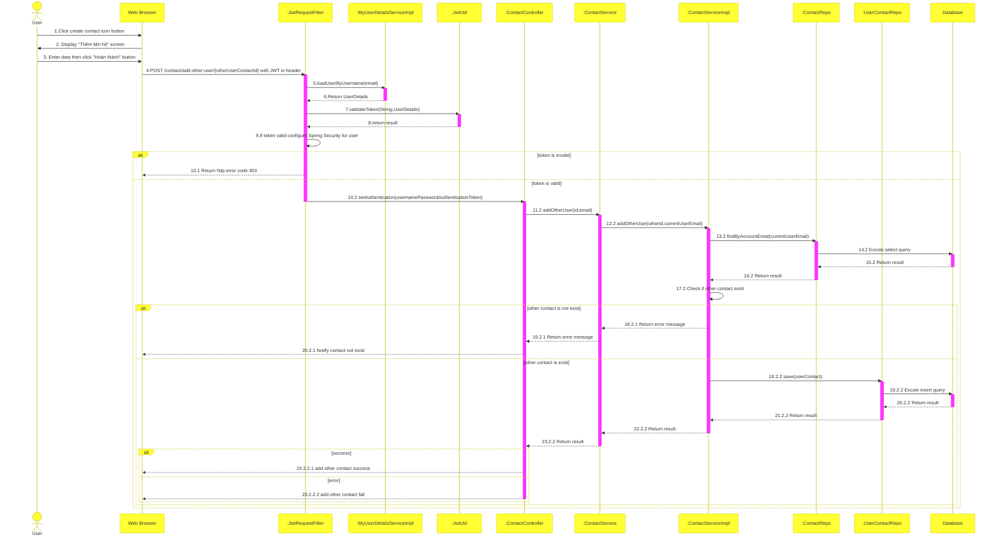
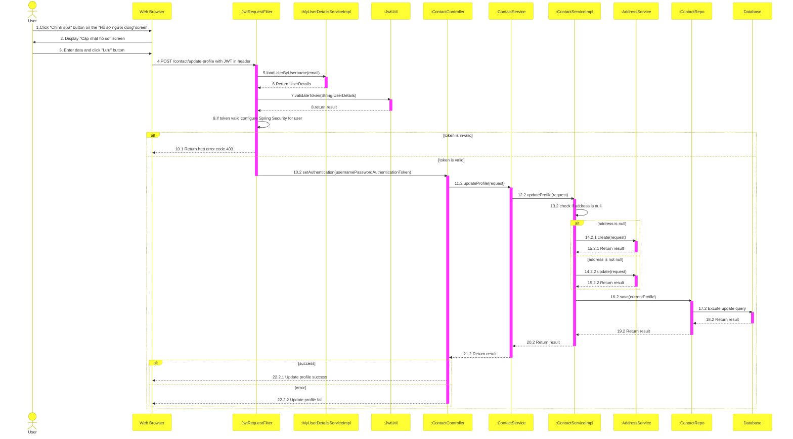
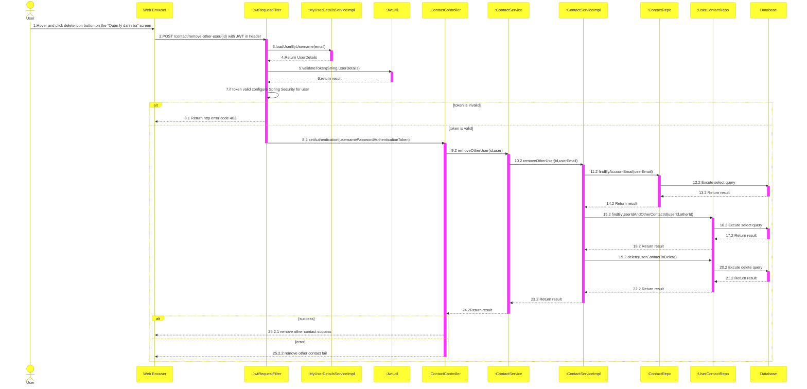
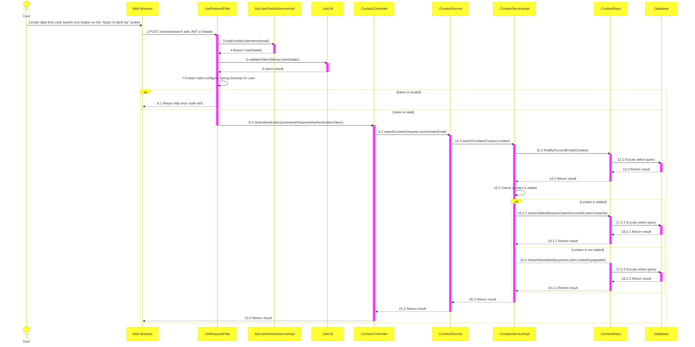
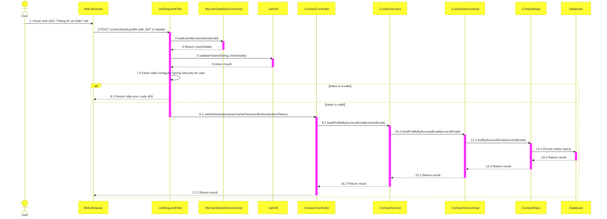

Create Contact

```mermaid
%%{init: {'theme': 'base', 'themeVariables': { 'primaryColor': '#FFFF33'}}}%%
sequenceDiagram
    actor User
    participant Web Browser
    participant #58;JwtRequestFilter
    participant #58;MyUserDetailsServiceImpl
    participant #58;JwtUtil
    participant #58;ContactController
    participant #58;ContactService
    participant #58;ContactServiceImpl
    participant #58;ContactRepo
    participant #58;UserContactRepo
    participant Database
    User->>Web Browser: 1.Click create contact icon button
    Web Browser->>User: 2. Display "Thêm liên hệ" screen
    User->>Web Browser: 3. Enter data then click "Hoàn thành" button
    Web Browser->>#58;JwtRequestFilter: 4.POST /contact/add-other-user/{otherUserContactId} with JWT in header
    activate #58;JwtRequestFilter
    #58;JwtRequestFilter->>#58;MyUserDetailsServiceImpl: 5.loadUserByUsername(email)
    activate #58;MyUserDetailsServiceImpl
    #58;MyUserDetailsServiceImpl-->>#58;JwtRequestFilter: 6.Return UserDetails
    deactivate #58;MyUserDetailsServiceImpl
    #58;JwtRequestFilter->>#58;JwtUtil: 7.validateToken(String,UserDetails)
    activate #58;JwtUtil
    #58;JwtUtil-->>#58;JwtRequestFilter: 8.return result
    deactivate #58;JwtUtil
    #58;JwtRequestFilter->>#58;JwtRequestFilter: 9.if token valid configure Spring Security for user    
    alt token is invalid
    #58;JwtRequestFilter-->>Web Browser: 10.1 Return http error code 403
    else token is valid    
    #58;JwtRequestFilter->>#58;ContactController: 10.2 setAuthentication(usernamePasswordAuthenticationToken);
    deactivate #58;JwtRequestFilter    
    activate #58;ContactController
    #58;ContactController->>#58;ContactService: 11.2 addOtherUser(id,email);
    activate #58;ContactService
    #58;ContactService->>#58;ContactServiceImpl: 12.2 addOtherUser(otherId,currentUserEmail);
    activate #58;ContactServiceImpl
    #58;ContactServiceImpl->>#58;ContactRepo:13.2 findByAccountEmail(currentUserEmail)
    activate #58;ContactRepo
    #58;ContactRepo->>Database:14.2 Excute select query
    activate Database   
    Database-->>#58;ContactRepo:15.2 Return result
    deactivate Database
    #58;ContactRepo-->>#58;ContactServiceImpl:16.2 Return result
    deactivate #58;ContactRepo
    #58;ContactServiceImpl->>#58;ContactServiceImpl:17.2 Check if other contact exist
    alt other contact is not exist
    #58;ContactServiceImpl-->>#58;ContactService:18.2.1 Return error message 
    #58;ContactService-->>#58;ContactController:19.2.1 Return error message
    #58;ContactController-->>Web Browser:20.2.1 Notify contact not exist
    else other contact is exist 
    #58;ContactServiceImpl->>#58;UserContactRepo: 18.2.2 save(userContact);
    activate #58;UserContactRepo
    #58;UserContactRepo->>Database: 19.2.2 Excute insert query
    activate Database
    Database-->>#58;UserContactRepo: 20.2.2 Return result;
    deactivate Database
    #58;UserContactRepo-->>#58;ContactServiceImpl: 21.2.2 Return result;
    deactivate #58;UserContactRepo
    #58;ContactServiceImpl-->>#58;ContactService: 22.2.2 Return result;
    deactivate #58;ContactServiceImpl
    #58;ContactService-->>#58;ContactController: 23.2.2 Return result;
    deactivate #58;ContactService
    alt success
		#58;ContactController-->>Web Browser: 23.2.2.1 add other contact success
	else error
		#58;ContactController-->>Web Browser: 23.2.2.2 add other contact fail
		deactivate #58;ContactController
	end
	end
	end
```

Update Profile

```mermaid
 %%{init: {'theme': 'base', 'themeVariables': {'primaryColor': '#FFFF33'}}}%%
sequenceDiagram
    actor User
    participant Web Browser
    participant #58;JwtRequestFilter
    participant #58;MyUserDetailsServiceImpl
    participant #58;JwtUtil
    participant #58;ContactController
    participant #58;ContactService
    participant #58;ContactServiceImpl
    participant #58;AddressService
    participant #58;ContactRepo
    participant Database
    User->>Web Browser:1.Click "Chỉnh sửa" button on the "Hồ sơ người dùng"screen
    Web Browser->>User:2. Display "Cập nhật hồ sơ" screen
    User->>Web Browser:3. Enter data and click "Lưu" button
    Web Browser->>#58;JwtRequestFilter: 4.POST /contact/update-profile with JWT in header
    activate #58;JwtRequestFilter
    #58;JwtRequestFilter->>#58;MyUserDetailsServiceImpl: 5.loadUserByUsername(email)
    activate #58;MyUserDetailsServiceImpl
    #58;MyUserDetailsServiceImpl-->>#58;JwtRequestFilter: 6.Return UserDetails
    deactivate #58;MyUserDetailsServiceImpl
    #58;JwtRequestFilter->>#58;JwtUtil: 7.validateToken(String,UserDetails)
    activate #58;JwtUtil
    #58;JwtUtil-->>#58;JwtRequestFilter: 8.return result
    deactivate #58;JwtUtil
    #58;JwtRequestFilter->>#58;JwtRequestFilter: 9.if token valid configure Spring Security for user    
    alt token is invalid
    #58;JwtRequestFilter-->>Web Browser: 10.1 Return http error code 403
    else token is valid    
    #58;JwtRequestFilter->>#58;ContactController: 10.2 setAuthentication(usernamePasswordAuthenticationToken);    
    deactivate #58;JwtRequestFilter
    activate #58;ContactController
    #58;ContactController->>#58;ContactService: 11.2 updateProfile(request);
    activate #58;ContactService
    #58;ContactService->>#58;ContactServiceImpl: 12.2 updateProfile(request);
    activate #58;ContactServiceImpl
    #58;ContactServiceImpl->>#58;ContactServiceImpl:13.2 check if address is null
    alt address is null
    #58;ContactServiceImpl->>#58;AddressService:14.2.1 create(request)
    activate #58;AddressService
    #58;AddressService-->>#58;ContactServiceImpl:15.2.1 Return result
    deactivate #58;AddressService
    else address is not null
    #58;ContactServiceImpl->>#58;AddressService:14.2.2 update(request)
    activate #58;AddressService
    #58;AddressService-->>#58;ContactServiceImpl:15.2.2 Return result
    deactivate #58;AddressService
    end
    #58;ContactServiceImpl->>#58;ContactRepo: 16.2 save(currentProfile);
    activate #58;ContactRepo
    #58;ContactRepo->>Database: 17.2 Excute update query
    activate Database
    Database-->>#58;ContactRepo: 18.2 Return result;
    deactivate Database
    #58;ContactRepo-->>#58;ContactServiceImpl: 19.2 Return result;
    deactivate #58;ContactRepo
    #58;ContactServiceImpl-->>#58;ContactService: 20.2 Return result;
    deactivate #58;ContactServiceImpl
    #58;ContactService-->>#58;ContactController: 21.2 Return result;
    deactivate #58;ContactService
    alt success
    #58;ContactController-->>Web Browser: 22.2.1 Update profile success
  else error
    #58;ContactController-->>Web Browser: 22.2.2 Update profile fail
    deactivate #58;ContactController
  end
  end
  
```

Remove Contact

```mermaid
%%{init: {'theme': 'base', 'themeVariables': {'primaryColor': '#FFFF33'}}}%%
sequenceDiagram
    actor User
    participant Web Browser
    participant #58;JwtRequestFilter
    participant #58;MyUserDetailsServiceImpl
    participant #58;JwtUtil
    participant #58;ContactController
    participant #58;ContactService
    participant #58;ContactServiceImpl
    participant #58;ContactRepo
    participant #58;UserContactRepo
    participant Database
    User->>Web Browser: 1.Hover and click delete icon button on the "Quản lý danh bạ" screen
    Web Browser->>#58;JwtRequestFilter: 2.POST /contact/remove-other-user/{id} with JWT in header
    activate #58;JwtRequestFilter
    #58;JwtRequestFilter->>#58;MyUserDetailsServiceImpl: 3.loadUserByUsername(email)
    activate #58;MyUserDetailsServiceImpl
    #58;MyUserDetailsServiceImpl-->>#58;JwtRequestFilter: 4.Return UserDetails
    deactivate #58;MyUserDetailsServiceImpl
    #58;JwtRequestFilter->>#58;JwtUtil: 5.validateToken(String,UserDetails)
    activate #58;JwtUtil
    #58;JwtUtil-->>#58;JwtRequestFilter: 6.return result
    deactivate #58;JwtUtil
    #58;JwtRequestFilter->>#58;JwtRequestFilter: 7.if token valid configure Spring Security for user    
    alt token is invalid
    #58;JwtRequestFilter-->>Web Browser: 8.1 Return http error code 403
    else token is valid   
    #58;JwtRequestFilter->>#58;ContactController: 8.2 setAuthentication(usernamePasswordAuthenticationToken);
    deactivate #58;JwtRequestFilter    
    activate #58;ContactController
    #58;ContactController->>#58;ContactService: 9.2 removeOtherUser(id,user);
    activate #58;ContactService
    #58;ContactService->>#58;ContactServiceImpl: 10.2 removeOtherUser(id,userEmail);
    activate #58;ContactServiceImpl
    #58;ContactServiceImpl->>#58;ContactRepo: 11.2 findByAccountEmail(userEmail);
    activate #58;ContactRepo
    #58;ContactRepo->>Database: 12.2 Excute select query
    activate Database
    Database-->>#58;ContactRepo: 13.2 Return result;
    deactivate Database
    #58;ContactRepo-->>#58;ContactServiceImpl: 14.2 Return result;
    deactivate #58;ContactRepo    
    #58;ContactServiceImpl->>#58;UserContactRepo:15.2 findByUserIdAndOtherContactId(userId,otherId)
    activate #58;UserContactRepo
    #58;UserContactRepo->> Database:16.2 Excute select query
    activate Database
    Database-->>#58;UserContactRepo:17.2 Return result
    deactivate Database
    #58;UserContactRepo-->>#58;ContactServiceImpl:18.2 Return result
    #58;ContactServiceImpl->>#58;UserContactRepo:19.2 delete(userContactToDelete)
    #58;UserContactRepo->>Database:20.2 Excute delete query
    activate Database
    Database-->>#58;UserContactRepo:21.2 Return result
    deactivate Database
    #58;UserContactRepo-->>#58;ContactServiceImpl:22.2 Return result
    deactivate #58;UserContactRepo
    #58;ContactServiceImpl-->>#58;ContactService:23.2 Return result
    deactivate #58;ContactServiceImpl
    #58;ContactService-->>#58;ContactController: 24.2Return result;
    deactivate #58;ContactService
    alt success
    #58;ContactController-->>Web Browser: 25.2.1 remove other contact success
  else error
    #58;ContactController-->>Web Browser: 25.2.2 remove other contact fail
    deactivate #58;ContactController
  end
  end
  
```
Search Contact

```mermaid
 %%{init: {'theme': 'base', 'themeVariables': {'primaryColor': '#FFFF33'}}}%%
sequenceDiagram
    actor User
    participant Web Browser
    participant #58;JwtRequestFilter
    participant #58;MyUserDetailsServiceImpl
    participant #58;JwtUtil
    participant #58;ContactController
    participant #58;ContactService
    participant #58;ContactServiceImpl
    participant #58;ContactRepo
    participant Database
    User->>Web Browser: 1.Enter data then click search icon button on the "Quản lý danh bạ" screen
    Web Browser->>#58;JwtRequestFilter: 2.POST /contact/search with JWT in header
    activate #58;JwtRequestFilter
    #58;JwtRequestFilter->>#58;MyUserDetailsServiceImpl: 3.loadUserByUsername(email)
    activate #58;MyUserDetailsServiceImpl
    #58;MyUserDetailsServiceImpl-->>#58;JwtRequestFilter: 4.Return UserDetails
    deactivate #58;MyUserDetailsServiceImpl
    #58;JwtRequestFilter->>#58;JwtUtil: 5.validateToken(String,UserDetails)
    activate #58;JwtUtil
    #58;JwtUtil-->>#58;JwtRequestFilter: 6.return result
    deactivate #58;JwtUtil
    #58;JwtRequestFilter->>#58;JwtRequestFilter: 7.if token valid configure Spring Security for user    
    alt token is invalid
    #58;JwtRequestFilter-->>Web Browser: 8.1 Return http error code 403
    else token is valid    
    #58;JwtRequestFilter->>#58;ContactController: 8.2 setAuthentication(usernamePasswordAuthenticationToken);
    deactivate #58;JwtRequestFilter    
    activate #58;ContactController
    #58;ContactController->>#58;ContactService: 9.2 searchContact(request,currentUserEmail);
    activate #58;ContactService
    #58;ContactService->>#58;ContactServiceImpl: 10.2 searchContact(Contact,creator);
    activate #58;ContactServiceImpl
    #58;ContactServiceImpl->>#58;ContactRepo: 11.2 findByAccountEmail(Contact);
    activate #58;ContactRepo
    #58;ContactRepo->>Database: 12.2 Excute select query
    activate Database
    Database-->>#58;ContactRepo: 13.2 Return result;
    deactivate Database
    #58;ContactRepo-->>#58;ContactServiceImpl: 14.2 Return result;
    deactivate #58;ContactRepo
    #58;ContactServiceImpl->>#58;ContactServiceImpl:15.2 Check contact is added
    alt contact is added
    #58;ContactServiceImpl->>#58;ContactRepo:16.2.1 seachAdded(keyword,teamId,eventId,userContactId)
    activate #58;ContactRepo
    #58;ContactRepo->>Database:17.2.1 Excute select query
    activate Database
    Database-->>#58;ContactRepo:18.2.1 Return result
    deactivate Database
    #58;ContactRepo-->>#58;ContactServiceImpl:19.2.1 Return result
    deactivate #58;ContactRepo
    else contact is not added
    #58;ContactServiceImpl-->#58;ContactRepo: 16.2.2seachNotAdded(keyword,userContactId,pageable)
    activate #58;ContactRepo
    #58;ContactRepo->>Database:17.2.2 Excute select query
    activate Database
    Database-->>#58;ContactRepo:18.2.2 Return result
    deactivate Database
    #58;ContactRepo-->>#58;ContactServiceImpl:19.2.2 Return result
    deactivate #58;ContactRepo
    end
    #58;ContactServiceImpl-->>#58;ContactService: 20.2 Return result;
    deactivate #58;ContactServiceImpl
    #58;ContactService-->>#58;ContactController: 21.2 Return result;
    deactivate #58;ContactService
    #58;ContactController-->>Web Browser: 22.2 Return result
    deactivate #58;ContactController
  end
  
  
```
Load Profile

```mermaid
sequenceDiagram
 %%{init: {'theme': 'base', 'themeVariables': {'primaryColor': '#FFFF33'}}}%%
    actor User
    participant Web Browser
    participant #58;JwtRequestFilter
    participant #58;MyUserDetailsServiceImpl
    participant #58;JwtUtil
    participant #58;ContactController
    participant #58;ContactService
    participant #58;ContactServiceImpl
    participant #58;ContactRepo
    participant Database
    User->>Web Browser: 1. Hover and click "Thông tin cá nhân" tab
    Web Browser->>#58;JwtRequestFilter: 2.POST /contact/load-profile with JWT in header
    activate #58;JwtRequestFilter
    #58;JwtRequestFilter->>#58;MyUserDetailsServiceImpl: 3.loadUserByUsername(email)
    activate #58;MyUserDetailsServiceImpl
    #58;MyUserDetailsServiceImpl-->>#58;JwtRequestFilter: 4.Return UserDetails
    deactivate #58;MyUserDetailsServiceImpl
    #58;JwtRequestFilter->>#58;JwtUtil: 5.validateToken(String,UserDetails)
    activate #58;JwtUtil
    #58;JwtUtil-->>#58;JwtRequestFilter: 6.return result
    deactivate #58;JwtUtil
    #58;JwtRequestFilter->>#58;JwtRequestFilter: 7.if token valid configure Spring Security for user
    alt token is invalid
    #58;JwtRequestFilter-->>Web Browser: 8.1 Return http error code 403
    else token is valid
    #58;JwtRequestFilter->>#58;ContactController: 8.2 setAuthentication(usernamePasswordAuthenticationToken);
    deactivate #58;JwtRequestFilter    
    activate #58;ContactController
    #58;ContactController->>#58;ContactService: 9.2 loadProfileByAccountEmail(currentEmail);
    activate #58;ContactService
    #58;ContactService->>#58;ContactServiceImpl: 10.2 loadProfileByAccountEmail(currentEmail);
    activate #58;ContactServiceImpl
    #58;ContactServiceImpl->>#58;ContactRepo: 11.2 findByAccountEmail(currentEmail);
    activate #58;ContactRepo
    #58;ContactRepo->>Database: 12.2 Excute select query
    activate Database
    Database-->>#58;ContactRepo: 13.2 Return result;
    deactivate Database
    #58;ContactRepo-->>#58;ContactServiceImpl: 14.2 Return result;
    deactivate #58;ContactRepo
    #58;ContactServiceImpl-->>#58;ContactService: 15.2 Return result;
    deactivate #58;ContactServiceImpl
    #58;ContactService-->>#58;ContactController: 16.2 Return result;
    deactivate #58;ContactService  
    #58;ContactController-->>Web Browser: 17.2 Return result
    deactivate #58;ContactController
end
```

