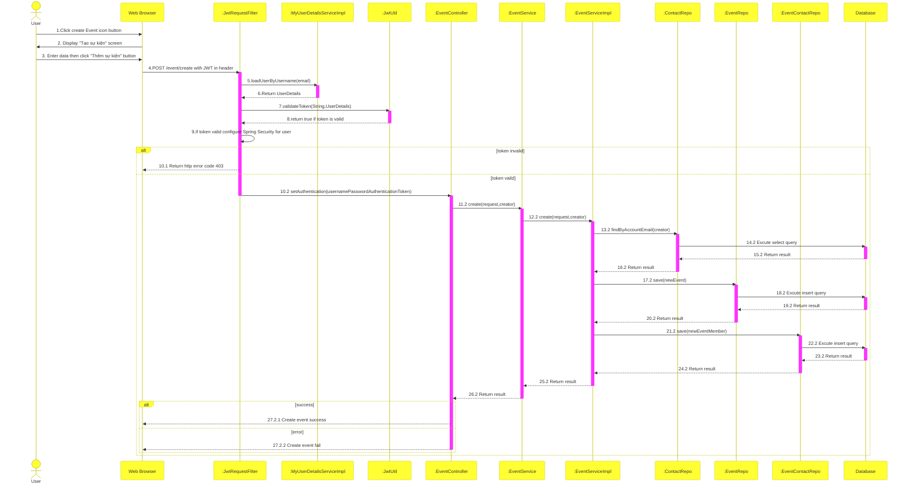
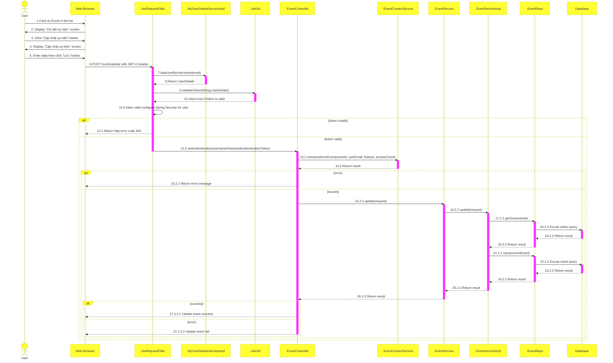
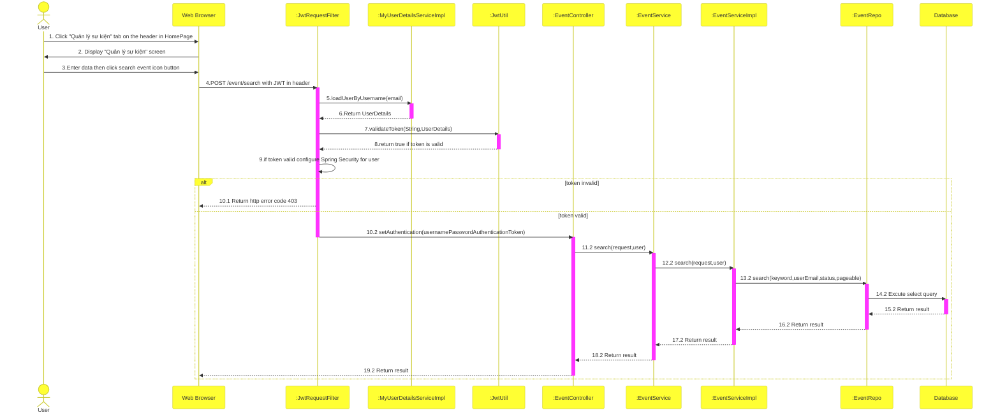
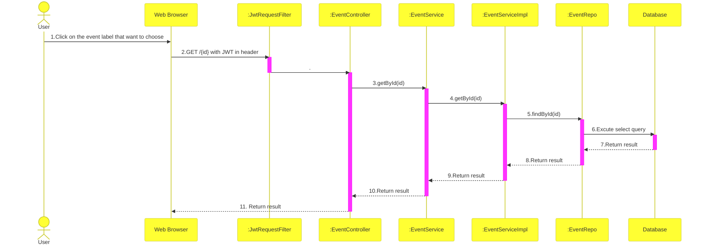

Create Event

```mermaid
%%{init: {'theme': 'base', 'themeVariables': { 'primaryColor': '#FFFF33'}}}%%
sequenceDiagram
    actor User
    participant Web Browser
    participant #58;JwtRequestFilter
    participant #58;MyUserDetailsServiceImpl
    participant #58;JwtUtil
    participant #58;EventController
    participant #58;EventService
    participant #58;EventServiceImpl
    participant #58;ContactRepo
    participant #58;EventRepo
    participant #58;EventContactRepo
    participant Database
    User->>Web Browser: 1.Click create Event icon button
    Web Browser->>User: 2. Display "Tạo sự kiện" screen
    User->>Web Browser: 3. Enter data then click "Thêm sự kiện" button
    Web Browser->>#58;JwtRequestFilter: 4.POST /event/create with JWT in header
    activate #58;JwtRequestFilter
    #58;JwtRequestFilter->>#58;MyUserDetailsServiceImpl: 5.loadUserByUsername(email)
    activate #58;MyUserDetailsServiceImpl
    #58;MyUserDetailsServiceImpl-->>#58;JwtRequestFilter: 6.Return UserDetails
    deactivate #58;MyUserDetailsServiceImpl
    #58;JwtRequestFilter->>#58;JwtUtil: 7.validateToken(String,UserDetails)
    activate #58;JwtUtil
    #58;JwtUtil-->>#58;JwtRequestFilter: 8.return true if token is valid
    deactivate #58;JwtUtil   
    #58;JwtRequestFilter->>#58;JwtRequestFilter: 9.if token valid configure Spring Security for user    
    alt token invalid
    #58;JwtRequestFilter-->>Web Browser: 10.1 Return http error code 403
    else token vaild
    #58;JwtRequestFilter->>#58;EventController: 10.2 setAuthentication(usernamePasswordAuthenticationToken);
    deactivate #58;JwtRequestFilter    
    activate #58;EventController
    #58;EventController->>#58;EventService: 11.2 create(request,creator);
    activate #58;EventService
    #58;EventService->>#58;EventServiceImpl: 12.2 create(request,creator);
    activate #58;EventServiceImpl
    #58;EventServiceImpl->>#58;ContactRepo: 13.2 findByAccountEmail(creator);
    activate #58;ContactRepo
    #58;ContactRepo->>Database: 14.2 Excute select query
    activate Database
    Database-->>#58;ContactRepo: 15.2 Return result
    deactivate Database
    #58;ContactRepo-->>#58;EventServiceImpl:16.2 Return result
    deactivate #58;ContactRepo
    #58;EventServiceImpl->>#58;EventRepo: 17.2 save(newEvent);
    activate #58;EventRepo
    #58;EventRepo->>Database: 18.2 Excute insert query
    activate Database
    Database-->>#58;EventRepo: 19.2 Return result
    deactivate Database
    #58;EventRepo-->>#58;EventServiceImpl: 20.2 Return result
    deactivate #58;EventRepo
    #58;EventServiceImpl->>#58;EventContactRepo:21.2 save(newEventMember)
    activate #58;EventContactRepo
    
    #58;EventContactRepo->>Database:22.2 Excute insert query
    activate Database
    Database-->>#58;EventContactRepo:23.2 Return result    
    deactivate Database
    #58;EventContactRepo-->>#58;EventServiceImpl:24.2 Return result
    deactivate #58;EventContactRepo
    #58;EventServiceImpl-->>#58;EventService: 25.2 Return result
    deactivate #58;EventServiceImpl
    #58;EventService-->>#58;EventController: 26.2 Return result
    deactivate #58;EventService
    alt success
		#58;EventController-->>Web Browser: 27.2.1 Create event success
	else error
		#58;EventController-->>Web Browser: 27.2.2 Create event fail
		deactivate #58;EventController
	end
	end
	
```

Update Event

```mermaid
 %%{init: {'theme': 'base', 'themeVariables': { 'primaryColor': '#FFFF33'}}}%%
sequenceDiagram
    actor User
    participant Web Browser
    participant #58;JwtRequestFilter
    participant #58;MyUserDetailsServiceImpl
    participant #58;JwtUtil
    participant #58;EventController
    participant #58;EventContactService
    participant #58;EventService
    participant #58;EventServiceImpl    
    participant #58;EventRepo    
    participant Database
    User->>Web Browser: 1.Click an Event in the list
    Web Browser->>User: 2. Display "Chi tiết sự kiện" screen
    User->>Web Browser: 3. Click "Cập nhật sự kiện" button
    Web Browser->>User: 4. Display "Cập nhật sự kiện" screen
    User->>Web Browser: 5. Enter data then click "Lưu" button
    Web Browser->>#58;JwtRequestFilter: 6.POST /event/update with JWT in header
    activate #58;JwtRequestFilter
    #58;JwtRequestFilter->>#58;MyUserDetailsServiceImpl: 7.loadUserByUsername(email)
    activate #58;MyUserDetailsServiceImpl
    #58;MyUserDetailsServiceImpl-->>#58;JwtRequestFilter: 8.Return UserDetails
    deactivate #58;MyUserDetailsServiceImpl
    #58;JwtRequestFilter->>#58;JwtUtil: 9.validateToken(String,UserDetails)
    activate #58;JwtUtil
    #58;JwtUtil-->>#58;JwtRequestFilter: 10.return true if token is valid
    deactivate #58;JwtUtil    
    #58;JwtRequestFilter->>#58;JwtRequestFilter: 11.if token valid configure Spring Security for user    
     alt token invalid
    #58;JwtRequestFilter-->>Web Browser: 12.1 Return http error code 403
    else token vaild
    #58;JwtRequestFilter->>#58;EventController: 12.2 setAuthentication(usernamePasswordAuthenticationToken);
    deactivate #58;JwtRequestFilter
    activate #58;EventController
    #58;EventController->>#58;EventContactService:13.2 checkAuthorInEvent(eventId, userEmail, feature, accessCheck);
    activate #58;EventContactService
    #58;EventContactService-->>#58;EventController:14.2 Return result
    deactivate #58;EventContactService
    alt error
    #58;EventController-->>Web Browser:15.2.1 Return error message
    else succes    
    #58;EventController->>#58;EventService: 15.2.2 update(request);
    activate #58;EventService
    #58;EventService->>#58;EventServiceImpl: 16.2.2 update(request);
    activate #58;EventServiceImpl
    #58;EventServiceImpl->>#58;EventRepo: 17.2.2 getOne(eventId);
    activate #58;EventRepo
    #58;EventRepo->>Database: 18.2.2 Excute select query
    activate Database
    Database-->>#58;EventRepo: 19.2.2 Return result
    deactivate Database
    #58;EventRepo-->>#58;EventServiceImpl:20.2.2 Return result
    deactivate #58;EventRepo
    #58;EventServiceImpl->>#58;EventRepo: 21.2.2 save(currentEvent);
    activate #58;EventRepo
    #58;EventRepo->>Database: 22.2.2 Excute insert query
    activate Database
    Database-->>#58;EventRepo: 23.2.2 Return result
    deactivate Database
    #58;EventRepo-->>#58;EventServiceImpl: 24.2.2 Return result
    deactivate #58;EventRepo    
    #58;EventServiceImpl-->>#58;EventService: 25.2.2 Return result
    deactivate #58;EventServiceImpl
    #58;EventService-->>#58;EventController: 26.2.2 Return result
    deactivate #58;EventService
    alt success
		#58;EventController-->>Web Browser: 27.2.2.1 Update event success
	else error
		#58;EventController-->>Web Browser: 27.2.2.2 Update event fail
		deactivate #58;EventController
	end
	end
	end
  
```

Search Event(s)

```mermaid
 %%{init: {'theme': 'base', 'themeVariables': {'primaryColor': '#FFFF33'}}}%%
sequenceDiagram
    actor User
    participant Web Browser
    participant #58;JwtRequestFilter
    participant #58;MyUserDetailsServiceImpl
    participant #58;JwtUtil
    participant #58;EventController
    participant #58;EventService
    participant #58;EventServiceImpl
    participant #58;EventRepo
    participant Database
    User->>Web Browser:1. Click "Quản lý sự kiện" tab on the header in HomePage
    Web Browser->>User: 2. Display "Quản lý sự kiện" screen
    User->>Web Browser: 3.Enter data then click search event icon button
    Web Browser->>#58;JwtRequestFilter: 4.POST /event/search with JWT in header
    activate #58;JwtRequestFilter    
    #58;JwtRequestFilter->>#58;MyUserDetailsServiceImpl: 5.loadUserByUsername(email)
    activate #58;MyUserDetailsServiceImpl    
    #58;MyUserDetailsServiceImpl-->>#58;JwtRequestFilter: 6.Return UserDetails
    deactivate #58;MyUserDetailsServiceImpl
    #58;JwtRequestFilter->>#58;JwtUtil: 7.validateToken(String,UserDetails)
    activate #58;JwtUtil
    #58;JwtUtil-->>#58;JwtRequestFilter: 8.return true if token is valid
    deactivate #58;JwtUtil
    #58;JwtRequestFilter->>#58;JwtRequestFilter: 9.if token valid configure Spring Security for user
    alt token invalid
    #58;JwtRequestFilter-->>Web Browser:10.1 Return http error code 403
    else token valid
    #58;JwtRequestFilter->>#58;EventController: 10.2 setAuthentication(usernamePasswordAuthenticationToken);
    deactivate #58;JwtRequestFilter
    activate #58;EventController
    #58;EventController->>#58;EventService: 11.2 search(request,user);
    activate #58;EventService
    #58;EventService->>#58;EventServiceImpl: 12.2 search(request,user);
    activate #58;EventServiceImpl
    #58;EventServiceImpl->>#58;EventRepo: 13.2 search(keyword,userEmail,status,pageable);
    activate #58;EventRepo
    #58;EventRepo->>Database: 14.2 Excute select query
    activate Database
    Database-->>#58;EventRepo: 15.2 Return result;
    deactivate Database
    #58;EventRepo-->>#58;EventServiceImpl: 16.2 Return result;
    deactivate #58;EventRepo
    #58;EventServiceImpl-->>#58;EventService: 17.2 Return result;
    deactivate #58;EventServiceImpl
    #58;EventService-->>#58;EventController: 18.2 Return result;
    deactivate #58;EventService
    #58;EventController-->>Web Browser: 19.2 Return result
    deactivate #58;EventController
  	end
```
View Event Detail

```mermaid
%%{init: {'theme': 'base', 'themeVariables': {'primaryColor': '#FFFF33'}}}%%
sequenceDiagram
    actor User
    participant Web Browser
    participant #58;JwtRequestFilter   
    participant #58;EventController
    participant #58;EventService
    participant #58;EventServiceImpl
    participant #58;EventRepo 
    participant Database
    User->>Web Browser: 1.Click on the event label that want to choose
    Web Browser->>#58;JwtRequestFilter: 2.GET /{id} with JWT in header
    activate #58;JwtRequestFilter   
    #58;JwtRequestFilter->>#58;EventController:.
    deactivate #58;JwtRequestFilter
    activate #58;EventController
    #58;EventController->>#58;EventService: 3.getById(id);
    activate #58;EventService
    #58;EventService->>#58;EventServiceImpl: 4.getById(id);
    activate #58;EventServiceImpl
    #58;EventServiceImpl->>#58;EventRepo: 5.findById(id);
    activate #58;EventRepo
    #58;EventRepo->>Database: 6.Excute select query
    activate Database
    Database-->>#58;EventRepo: 7.Return result;
    deactivate Database
    #58;EventRepo-->>#58;EventServiceImpl: 8.Return result;
    deactivate #58;EventRepo
    #58;EventServiceImpl-->>#58;EventService: 9.Return result;
    deactivate #58;EventServiceImpl
    #58;EventService-->>#58;EventController: 10.Return result;
    deactivate #58;EventService
    #58;EventController-->>Web Browser: 11. Return result
    deactivate #58;EventController

```

