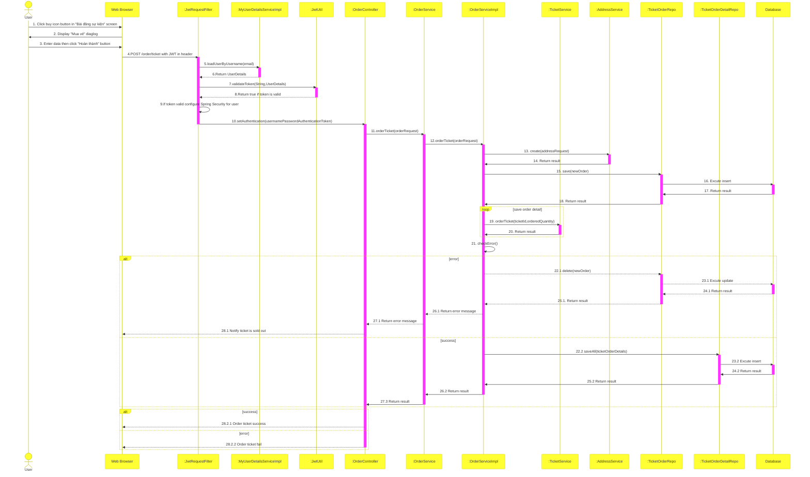
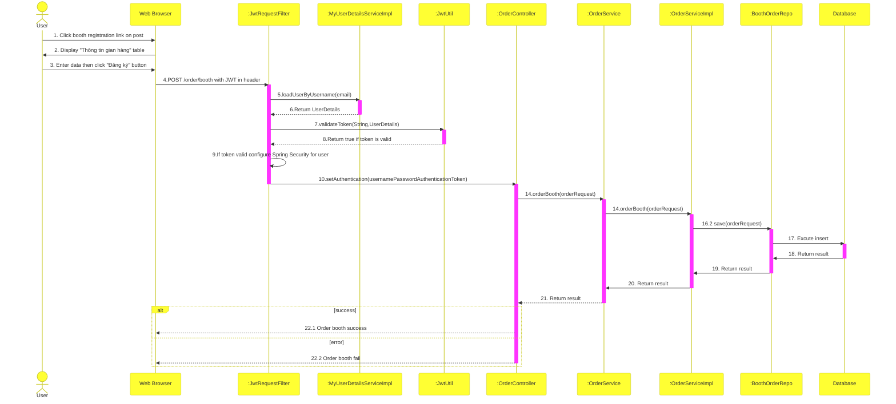

Order Ticket

```mermaid
%%{init: {'theme': 'base', 'themeVariables': { 'primaryColor': '#FFFF33'}}}%%
sequenceDiagram
    actor User
    participant Web Browser
    participant #58;JwtRequestFilter
    participant #58;MyUserDetailsServiceImpl
    participant #58;JwtUtil
    participant #58;OrderController
    participant #58;OrderService
    participant #58;OrderServiceImpl
    participant #58;TicketService
    participant #58;AddressService
    participant #58;TicketOrderRepo
    participant #58;TicketOrderDetailRepo
    participant Database
    User->>Web Browser: 1. Click buy icon button in "Bài đăng sự kiện" screen
    Web Browser->>User: 2. Display "Mua vé" diaglog
    User->>Web Browser: 3. Enter data then click "Hoàn thành" button    
    Web Browser->>#58;JwtRequestFilter: 4.POST /order/ticket with JWT in header
    activate #58;JwtRequestFilter
    #58;JwtRequestFilter->>#58;MyUserDetailsServiceImpl: 5.loadUserByUsername(email)
    activate #58;MyUserDetailsServiceImpl
    #58;MyUserDetailsServiceImpl-->>#58;JwtRequestFilter: 6.Return UserDetails
    deactivate #58;MyUserDetailsServiceImpl
    #58;JwtRequestFilter->>#58;JwtUtil: 7.validateToken(String,UserDetails)
    activate #58;JwtUtil
    #58;JwtUtil-->>#58;JwtRequestFilter: 8.Return true if token is valid
    deactivate #58;JwtUtil
    #58;JwtRequestFilter->>#58;JwtRequestFilter: 9.If token valid configure Spring Security for user    
    #58;JwtRequestFilter->>#58;OrderController: 10.setAuthentication(usernamePasswordAuthenticationToken);
    deactivate #58;JwtRequestFilter     
    activate #58;OrderController
    #58;OrderController->>#58;OrderService: 11.orderTicket(orderRequest);
    activate #58;OrderService   
    #58;OrderService->>#58;OrderServiceImpl: 12.orderTicket(orderRequest);
    activate #58;OrderServiceImpl   
    #58;OrderServiceImpl->>#58;AddressService: 13. create(addressRequest);
    activate #58;AddressService
    #58;AddressService->>#58;OrderServiceImpl: 14. Return result;
    deactivate #58;AddressService
    #58;OrderServiceImpl->>#58;TicketOrderRepo: 15. save(newOrder);
    activate #58;TicketOrderRepo
    #58;TicketOrderRepo->>Database: 16. Excute insert;
    activate Database
    Database->>#58;TicketOrderRepo: 17. Return result;
    deactivate Database
    #58;TicketOrderRepo->>#58;OrderServiceImpl: 18. Return result;
    deactivate #58;TicketOrderRepo
    loop save order detail
    #58;OrderServiceImpl->>#58;TicketService: 19. orderTicket(ticketId,orderedQuantity);
    activate #58;TicketService
    #58;TicketService->>#58;OrderServiceImpl: 20. Return result;
    deactivate #58;TicketService
    end
    #58;OrderServiceImpl->>#58;OrderServiceImpl: 21. checkError();
     alt error
     	#58;OrderServiceImpl-->>#58;TicketOrderRepo:22.1 delete(newOrder);
    	activate #58;TicketOrderRepo
    	#58;TicketOrderRepo-->>Database: 23.1 Excute update;
    activate Database
    Database-->>#58;TicketOrderRepo: 24.1 Return result;
    deactivate Database
    	#58;TicketOrderRepo-->>#58;OrderServiceImpl:25.1. Return result;
    	deactivate #58;TicketOrderRepo
		#58;OrderServiceImpl-->>#58;OrderService: 26.1 Return error message
		#58;OrderService-->>#58;OrderController: 27.1 Return error message
		#58;OrderController-->>Web Browser: 28.1 Notify ticket is sold out
	else success
	#58;OrderServiceImpl->>#58;TicketOrderDetailRepo: 22.2 saveAll(ticketOrderDetails);
	activate #58;TicketOrderDetailRepo
    	#58;TicketOrderDetailRepo->>Database: 23.2 Excute insert;
    activate Database
    Database->>#58;TicketOrderDetailRepo: 24.2 Return result;
    deactivate Database
    	#58;TicketOrderDetailRepo->>#58;OrderServiceImpl: 25.2 Return result;
    	deactivate #58;TicketOrderDetailRepo
    	#58;OrderServiceImpl->>#58;OrderService: 26.2  Return result;
    deactivate #58;OrderServiceImpl
    #58;OrderService->>#58;OrderController: 27.3  Return result;
    deactivate #58;OrderService
    	
    end   
    alt success
		#58;OrderController-->>Web Browser: 28.2.1 Order ticket success
	else error
		#58;OrderController-->>Web Browser: 28.2.2 Order ticket fail
		deactivate #58;OrderController
	end
	
	
```
Order Booth

```mermaid
%%{init: {'theme': 'base', 'themeVariables': { 'primaryColor': '#FFFF33'}}}%%
sequenceDiagram
    actor User
    participant Web Browser
    participant #58;JwtRequestFilter
    participant #58;MyUserDetailsServiceImpl
    participant #58;JwtUtil
    participant #58;OrderController
    participant #58;OrderService
    participant #58;OrderServiceImpl
    participant #58;BoothOrderRepo
    participant Database
    User->>Web Browser: 1. Click booth registration link on post 
    Web Browser->>User: 2. Display "Thông tin gian hàng" table
    User->>Web Browser: 3. Enter data then click "Đăng ký" button    
    Web Browser->>#58;JwtRequestFilter: 4.POST /order/booth with JWT in header
    activate #58;JwtRequestFilter
    #58;JwtRequestFilter->>#58;MyUserDetailsServiceImpl: 5.loadUserByUsername(email)
    activate #58;MyUserDetailsServiceImpl
    #58;MyUserDetailsServiceImpl-->>#58;JwtRequestFilter: 6.Return UserDetails
    deactivate #58;MyUserDetailsServiceImpl
    #58;JwtRequestFilter->>#58;JwtUtil: 7.validateToken(String,UserDetails)
    activate #58;JwtUtil
    #58;JwtUtil-->>#58;JwtRequestFilter: 8.Return true if token is valid
    deactivate #58;JwtUtil
    #58;JwtRequestFilter->>#58;JwtRequestFilter: 9.If token valid configure Spring Security for user    
    #58;JwtRequestFilter->>#58;OrderController: 10.setAuthentication(usernamePasswordAuthenticationToken);
    deactivate #58;JwtRequestFilter     
    activate #58;OrderController
    #58;OrderController->>#58;OrderService: 14.orderBooth(orderRequest);
    activate #58;OrderService
    #58;OrderService->>#58;OrderServiceImpl: 14.orderBooth(orderRequest);
    activate #58;OrderServiceImpl
    #58;OrderServiceImpl->>#58;BoothOrderRepo: 16.2 save(orderRequest);
    activate #58;BoothOrderRepo
    #58;BoothOrderRepo->>Database: 17. Excute insert    
    activate Database
    Database->>#58;BoothOrderRepo: 18. Return result    
    deactivate Database
    #58;BoothOrderRepo->>#58;OrderServiceImpl: 19. Return result
    deactivate #58;BoothOrderRepo
    #58;OrderServiceImpl->>#58;OrderService: 20. Return result
    deactivate #58;OrderServiceImpl
    #58;OrderService-->>#58;OrderController: 21. Return result
    deactivate #58;OrderService
    alt success
		#58;OrderController-->>Web Browser: 22.1 Order booth success
	else error
		#58;OrderController-->>Web Browser: 22.2 Order booth fail
		deactivate #58;OrderController
	end
	
	
```


​	

```
```