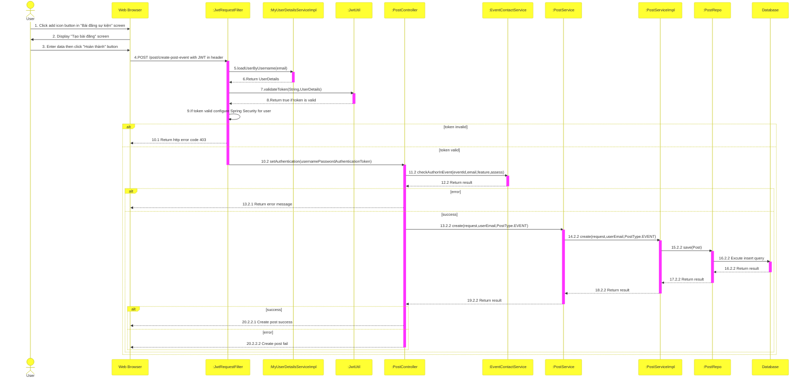
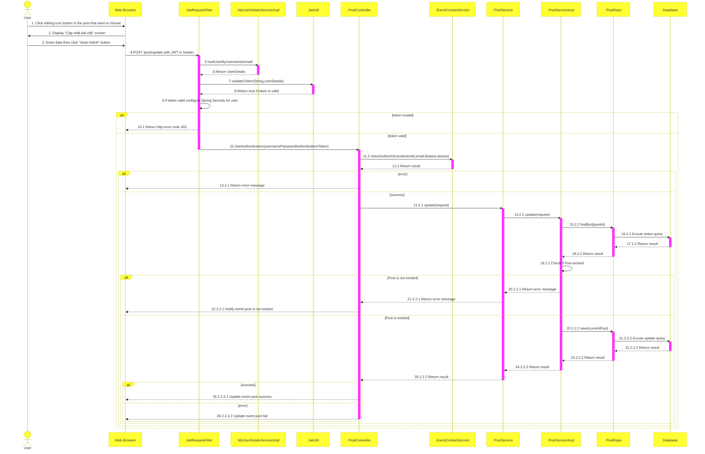
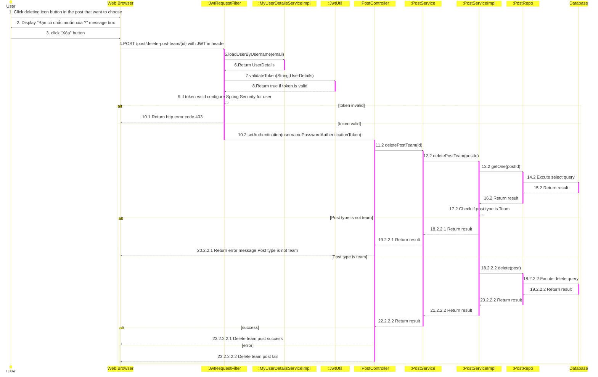
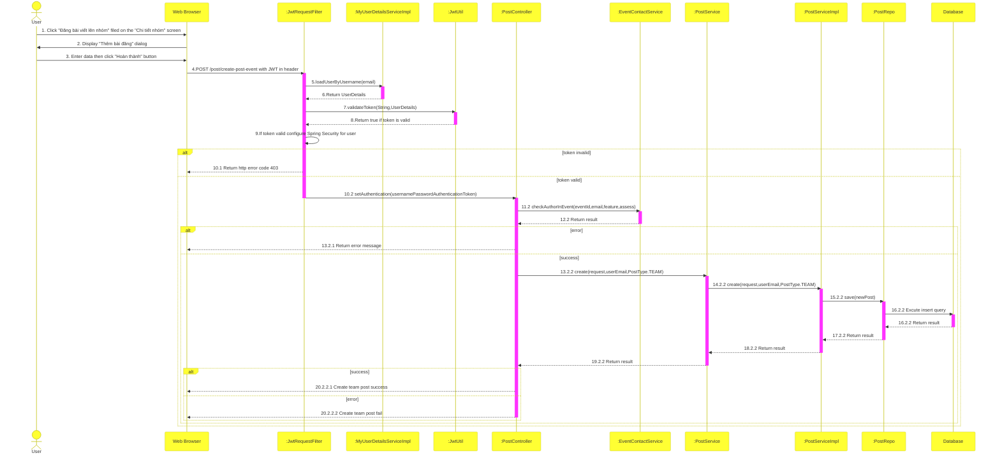
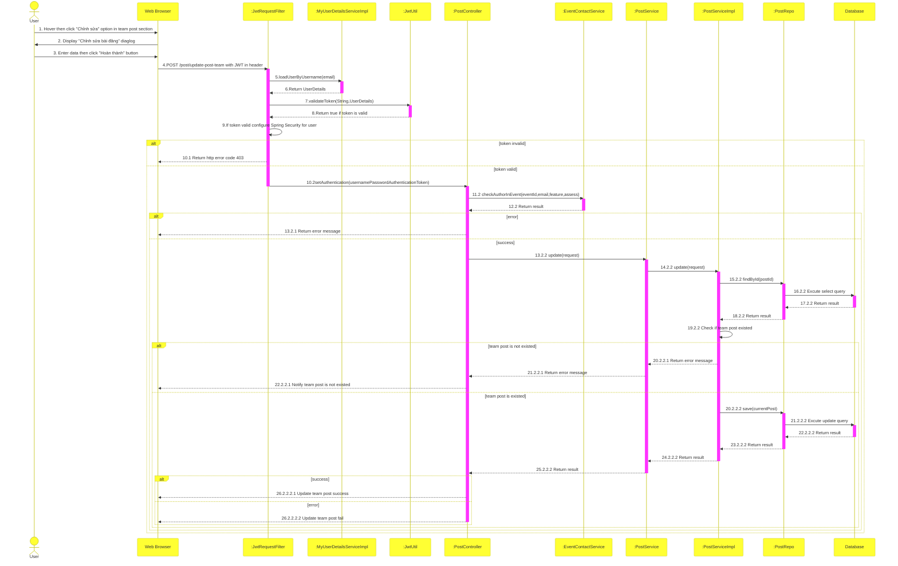
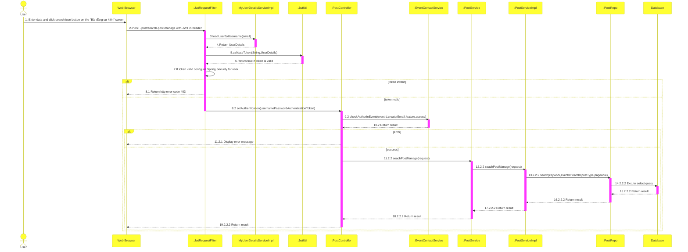
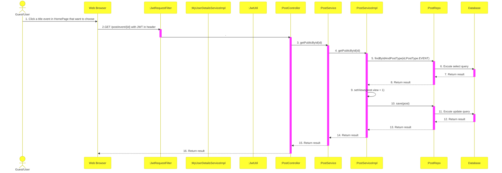

Create Event Post

```mermaid
%%{init: {'theme': 'base', 'themeVariables': {'primaryColor': '#FFFF33'}}}%%
sequenceDiagram
    actor User
    participant Web Browser
    participant #58;JwtRequestFilter
    participant #58;MyUserDetailsServiceImpl
    participant #58;JwtUtil
    participant #58;PostController
    participant #58;EventContactService    
    participant #58;PostService
    participant #58;PostServiceImpl
    participant #58;PostRepo
    participant Database
    User->>Web Browser: 1. Click add icon button in "Bài đăng sự kiện" screen
    Web Browser->>User: 2. Display "Tạo bài đăng" screen    
    User->>Web Browser: 3. Enter data then click "Hoàn thành" button    
    Web Browser->>#58;JwtRequestFilter: 4.POST /post/create-post-event with JWT in header
    activate #58;JwtRequestFilter
    #58;JwtRequestFilter->>#58;MyUserDetailsServiceImpl: 5.loadUserByUsername(email)
    activate #58;MyUserDetailsServiceImpl
    #58;MyUserDetailsServiceImpl-->>#58;JwtRequestFilter: 6.Return UserDetails
    deactivate #58;MyUserDetailsServiceImpl
    #58;JwtRequestFilter->>#58;JwtUtil: 7.validateToken(String,UserDetails)
    activate #58;JwtUtil
    #58;JwtUtil-->>#58;JwtRequestFilter: 8.Return true if token is valid
    deactivate #58;JwtUtil
    #58;JwtRequestFilter->>#58;JwtRequestFilter: 9.If token valid configure Spring Security for user 
    alt token invalid
    #58;JwtRequestFilter-->>Web Browser:10.1 Return http error code 403
    else token valid
    #58;JwtRequestFilter->>#58;PostController: 10.2 setAuthentication(usernamePasswordAuthenticationToken);
    deactivate #58;JwtRequestFilter     
    activate #58;PostController
    #58;PostController->>#58;EventContactService: 11.2 checkAuthorInEvent(eventId,email,feature,assess);
    activate #58;EventContactService   
    #58;EventContactService-->>#58;PostController:12.2 Return result
    deactivate #58;EventContactService
    alt error
		#58;PostController-->>Web Browser: 13.2.1 Return error message
	else success		
    #58;PostController->>#58;PostService: 13.2.2 create(request,userEmail,PostType.EVENT);
    activate #58;PostService       
    #58;PostService->>#58;PostServiceImpl: 14.2.2 create(request,userEmail,PostType.EVENT);
    activate #58;PostServiceImpl
    #58;PostServiceImpl->>#58;PostRepo: 15.2.2 save(Post);
    activate #58;PostRepo
    #58;PostRepo->>Database: 16.2.2 Excute insert query    
    activate Database
    Database-->>#58;PostRepo: 16.2.2 Return result    
    deactivate Database
    #58;PostRepo-->>#58;PostServiceImpl: 17.2.2 Return result
    deactivate #58;PostRepo
    #58;PostServiceImpl-->>#58;PostService: 18.2.2 Return result
    deactivate #58;PostServiceImpl
    #58;PostService-->>#58;PostController: 19.2.2 Return result
    deactivate #58;PostService
    alt success
		#58;PostController-->>Web Browser: 20.2.2.1 Create post success
	else error
		#58;PostController-->>Web Browser: 20.2.2.2 Create post fail
		deactivate #58;PostController
	end
	end
    end
	
	
```
Update Event Post

```mermaid
%%{init: {'theme': 'base', 'themeVariables': { 'primaryColor': '#FFFF33'}}}%%
sequenceDiagram
    actor User
    participant Web Browser
    participant #58;JwtRequestFilter
    participant #58;MyUserDetailsServiceImpl
    participant #58;JwtUtil
    participant #58;PostController
    participant #58;EventContactService
    participant #58;PostService
    participant #58;PostServiceImpl
    participant #58;PostRepo
    participant Database
    User->>Web Browser: 1. Click editing icon button in the post that want to choose    
    Web Browser->>User: 2. Display "Cập nhật bài viết" screen
    User->>Web Browser: 3. Enter data then click "Hoàn thành" button    
    Web Browser->>#58;JwtRequestFilter: 4.POST /post/update with JWT in header
    activate #58;JwtRequestFilter
    #58;JwtRequestFilter->>#58;MyUserDetailsServiceImpl: 5.loadUserByUsername(email)
    activate #58;MyUserDetailsServiceImpl
    #58;MyUserDetailsServiceImpl-->>#58;JwtRequestFilter: 6.Return UserDetails
    deactivate #58;MyUserDetailsServiceImpl
    #58;JwtRequestFilter->>#58;JwtUtil: 7.validateToken(String,UserDetails)
    activate #58;JwtUtil
    #58;JwtUtil-->>#58;JwtRequestFilter: 8.Return true if token is valid
    deactivate #58;JwtUtil
    #58;JwtRequestFilter->>#58;JwtRequestFilter: 9.If token valid configure Spring Security for user
     alt token invalid
    #58;JwtRequestFilter-->>Web Browser:10.1 Return http error code 403
    else token valid
    #58;JwtRequestFilter->>#58;PostController: 10.2setAuthentication(usernamePasswordAuthenticationToken);   
    deactivate #58;JwtRequestFilter     
    activate #58;PostController
    #58;PostController->>#58;EventContactService: 11.2 checkAuthorInEvent(eventId,email,feature,assess);
    activate #58;EventContactService     
    #58;EventContactService-->>#58;PostController:12.2 Return result
    deactivate #58;EventContactService
    alt error
		#58;PostController-->>Web Browser: 13.2.1 Return error message
	else success		
    #58;PostController->>#58;PostService:13.2.2 update(request);
    activate #58;PostService        
    #58;PostService->>#58;PostServiceImpl:14.2.2 update(request);
    activate #58;PostServiceImpl
    #58;PostServiceImpl->>#58;PostRepo:15.2.2 findById(postId);
    activate #58;PostRepo
    #58;PostRepo->>Database:16.2.2 Excute select query
    activate Database
    Database-->>#58;PostRepo:17.2.2 Return result    
    deactivate Database
    #58;PostRepo-->>#58;PostServiceImpl:18.2.2 Return result
    deactivate #58;PostRepo
    #58;PostServiceImpl->>#58;PostServiceImpl:19.2.2 Check if Post existed
    alt Post is not existed
		#58;PostServiceImpl-->>#58;PostService: 20.2.2.1 Return error message
		#58;PostService-->>#58;PostController: 21.2.2.1 Return error message
		#58;PostController-->>Web Browser: 22.2.2.1 Notify event post is not existed 
	else Post is existed
    #58;PostServiceImpl->>#58;PostRepo: 20.2.2.2 save(currentPost);    
    activate #58;PostRepo
    #58;PostRepo->>Database: 21.2.2.2 Excute update query    
    activate Database
    Database-->>#58;PostRepo: 22.2.2.2 Return result    
    deactivate Database
    #58;PostRepo-->>#58;PostServiceImpl: 23.2.2.2 Return result
    deactivate #58;PostRepo
    #58;PostServiceImpl-->>#58;PostService: 24.2.2.2 Return result
    deactivate #58;PostServiceImpl
    #58;PostService-->>#58;PostController: 25.2.2.2 Return result
    deactivate #58;PostService
    alt success
		#58;PostController-->>Web Browser: 26.2.2.2.1 Update event post success
	else error
		#58;PostController-->>Web Browser: 26.2.2.2.2 Update event post fail
		deactivate #58;PostController
	end
	end
	end
	end
	
	
```
Delete Team Post

```mermaid
%%{init: {'theme': 'base', 'fontSize': '50px', 'themeVariables': {'primaryColor': '#FFFF33'}}}%%
sequenceDiagram
    actor User
    participant Web Browser
    participant #58;JwtRequestFilter
    participant #58;MyUserDetailsServiceImpl
    participant #58;JwtUtil
    participant #58;PostController    
    participant #58;PostService
    participant #58;PostServiceImpl
    participant #58;PostRepo
    participant Database
    User->>Web Browser: 1. Click deleting icon button in the post that want to choose   
    Web Browser->>User: 2. Display "Bạn có chắc muốn xóa ?" message box
    User->>Web Browser: 3. click "Xóa" button    
    Web Browser->>#58;JwtRequestFilter: 4.POST /post/delete-post-team/{id} with JWT in header
    activate #58;JwtRequestFilter
    #58;JwtRequestFilter->>#58;MyUserDetailsServiceImpl: 5.loadUserByUsername(email)
    activate #58;MyUserDetailsServiceImpl
    #58;MyUserDetailsServiceImpl-->>#58;JwtRequestFilter: 6.Return UserDetails
    deactivate #58;MyUserDetailsServiceImpl
    #58;JwtRequestFilter->>#58;JwtUtil: 7.validateToken(String,UserDetails)
    activate #58;JwtUtil
    #58;JwtUtil-->>#58;JwtRequestFilter: 8.Return true if token is valid
    deactivate #58;JwtUtil
    #58;JwtRequestFilter->>#58;JwtRequestFilter: 9.If token valid configure Spring Security for user
    alt token invalid
    #58;JwtRequestFilter-->>Web Browser:10.1 Return http error code 403
    else token valid
    #58;JwtRequestFilter->>#58;PostController: 10.2 setAuthentication(usernamePasswordAuthenticationToken);
    deactivate #58;JwtRequestFilter     
    activate #58;PostController   		
    #58;PostController->>#58;PostService: 11.2 deletePostTeam(id);
    activate #58;PostService       
    #58;PostService->>#58;PostServiceImpl: 12.2 deletePostTeam(postId);
    activate #58;PostServiceImpl
    #58;PostServiceImpl->>#58;PostRepo:13.2 getOne(postId)
    activate #58;PostRepo
    #58;PostRepo->>Database:14.2 Excute select query
    activate Database
    Database-->>#58;PostRepo:15.2 Return result
    deactivate Database
    #58;PostRepo-->>#58;PostServiceImpl:16.2 Return result
    deactivate #58;PostRepo
    #58;PostServiceImpl->>#58;PostServiceImpl: 17.2 Check if post type is Team
    alt Post type is not team
		#58;PostServiceImpl-->>#58;PostService: 18.2.2.1 Return result
		#58;PostService-->>#58;PostController: 19.2.2.1 Return result
		#58;PostController-->>Web Browser: 20.2.2.1 Return error message Post type is not team
	else Post type is team	
    #58;PostServiceImpl->>#58;PostRepo: 18.2.2.2 delete(post);
    activate #58;PostRepo      
    #58;PostRepo->>Database: 18.2.2.2 Excute delete query    
    activate Database
    Database-->>#58;PostRepo: 19.2.2.2 Return result    
    deactivate Database
    #58;PostRepo-->>#58;PostServiceImpl: 20.2.2.2 Return result
    deactivate #58;PostRepo
    #58;PostServiceImpl-->>#58;PostService: 21.2.2.2 Return result
    deactivate #58;PostServiceImpl
    #58;PostService-->>#58;PostController: 22.2.2.2 Return result
    deactivate #58;PostService
    alt success
		#58;PostController-->>Web Browser: 23.2.2.2.1  Delete team post success
	else error
		#58;PostController-->>Web Browser: 23.2.2.2.2  Delete team post fail
		deactivate #58;PostController
	end
	end
	end
	
```
Create Team Post 

```mermaid
%%{init: {'theme': 'base', 'themeVariables': { 'primaryColor': '#FFFF33'}}}%%
sequenceDiagram
    actor User
    participant Web Browser
    participant #58;JwtRequestFilter
    participant #58;MyUserDetailsServiceImpl
    participant #58;JwtUtil
    participant #58;PostController
    participant #58;EventContactService    
    participant #58;PostService
    participant #58;PostServiceImpl
    participant #58;PostRepo
    participant Database
    User->>Web Browser: 1. Click "Đăng bài viết lên nhóm" filed on the "Chi tiết nhóm" screen
    Web Browser->>User: 2. Display "Thêm bài đăng" dialog    
    User->>Web Browser: 3. Enter data then click "Hoàn thành" button    
     Web Browser->>#58;JwtRequestFilter: 4.POST /post/create-post-event with JWT in header
    activate #58;JwtRequestFilter
    #58;JwtRequestFilter->>#58;MyUserDetailsServiceImpl: 5.loadUserByUsername(email)
    activate #58;MyUserDetailsServiceImpl
    #58;MyUserDetailsServiceImpl-->>#58;JwtRequestFilter: 6.Return UserDetails
    deactivate #58;MyUserDetailsServiceImpl
    #58;JwtRequestFilter->>#58;JwtUtil: 7.validateToken(String,UserDetails)
    activate #58;JwtUtil
    #58;JwtUtil-->>#58;JwtRequestFilter: 8.Return true if token is valid
    deactivate #58;JwtUtil
    #58;JwtRequestFilter->>#58;JwtRequestFilter: 9.If token valid configure Spring Security for user 
    alt token invalid
    #58;JwtRequestFilter-->>Web Browser:10.1 Return http error code 403
    else token valid
    #58;JwtRequestFilter->>#58;PostController: 10.2 setAuthentication(usernamePasswordAuthenticationToken);
    deactivate #58;JwtRequestFilter     
    activate #58;PostController
    #58;PostController->>#58;EventContactService: 11.2 checkAuthorInEvent(eventId,email,feature,assess);
    activate #58;EventContactService   
    #58;EventContactService-->>#58;PostController:12.2 Return result
    deactivate #58;EventContactService
    alt error
		#58;PostController-->>Web Browser: 13.2.1 Return error message
	else success		
    #58;PostController->>#58;PostService:13.2.2 create(request,userEmail,PostType.TEAM);
    activate #58;PostService       
    #58;PostService->>#58;PostServiceImpl:14.2.2 create(request,userEmail,PostType.TEAM);
    activate #58;PostServiceImpl
    #58;PostServiceImpl->>#58;PostRepo: 15.2.2 save(newPost);
    activate #58;PostRepo
    #58;PostRepo->>Database: 16.2.2 Excute insert query    
    activate Database
    Database-->>#58;PostRepo: 16.2.2 Return result    
    deactivate Database
    #58;PostRepo-->>#58;PostServiceImpl: 17.2.2 Return result
    deactivate #58;PostRepo
    #58;PostServiceImpl-->>#58;PostService: 18.2.2 Return result
    deactivate #58;PostServiceImpl
    #58;PostService-->>#58;PostController: 19.2.2 Return result
    deactivate #58;PostService
    alt success
		#58;PostController-->>Web Browser: 20.2.2.1 Create team post success
	else error
		#58;PostController-->>Web Browser: 20.2.2.2 Create team post fail
		deactivate #58;PostController
	end
	end
    end
	
```
Update Team Post

```mermaid
%%{init: {'theme': 'base', 'themeVariables': { 'primaryColor': '#FFFF33'}}}%%
sequenceDiagram
    actor User
    participant Web Browser
    participant #58;JwtRequestFilter
    participant #58;MyUserDetailsServiceImpl
    participant #58;JwtUtil
    participant #58;PostController
    participant #58;EventContactService
    participant #58;PostService
    participant #58;PostServiceImpl
    participant #58;PostRepo
    participant Database
    User->>Web Browser: 1. Hover then click "Chỉnh sửa" option in team post section
    Web Browser->>User: 2. Display "Chỉnh sửa bài đăng" diaglog
    User->>Web Browser: 3. Enter data then click "Hoàn thành" button    
    Web Browser->>#58;JwtRequestFilter: 4.POST /post/update-post-team with JWT in header
     activate #58;JwtRequestFilter
    #58;JwtRequestFilter->>#58;MyUserDetailsServiceImpl: 5.loadUserByUsername(email)
    activate #58;MyUserDetailsServiceImpl
    #58;MyUserDetailsServiceImpl-->>#58;JwtRequestFilter: 6.Return UserDetails
    deactivate #58;MyUserDetailsServiceImpl
    #58;JwtRequestFilter->>#58;JwtUtil: 7.validateToken(String,UserDetails)
    activate #58;JwtUtil
    #58;JwtUtil-->>#58;JwtRequestFilter: 8.Return true if token is valid
    deactivate #58;JwtUtil
    #58;JwtRequestFilter->>#58;JwtRequestFilter: 9.If token valid configure Spring Security for user
     alt token invalid
    #58;JwtRequestFilter-->>Web Browser:10.1 Return http error code 403
    else token valid
    #58;JwtRequestFilter->>#58;PostController: 10.2setAuthentication(usernamePasswordAuthenticationToken);   
    deactivate #58;JwtRequestFilter     
    activate #58;PostController
    #58;PostController->>#58;EventContactService: 11.2 checkAuthorInEvent(eventId,email,feature,assess);
    activate #58;EventContactService     
    #58;EventContactService-->>#58;PostController:12.2 Return result
    deactivate #58;EventContactService
    alt error
		#58;PostController-->>Web Browser: 13.2.1 Return error message
	else success		
    #58;PostController->>#58;PostService:13.2.2 update(request);
    activate #58;PostService        
    #58;PostService->>#58;PostServiceImpl:14.2.2 update(request);
    activate #58;PostServiceImpl
    #58;PostServiceImpl->>#58;PostRepo:15.2.2 findById(postId);
    activate #58;PostRepo
    #58;PostRepo->>Database:16.2.2 Excute select query
    activate Database
    Database-->>#58;PostRepo:17.2.2 Return result    
    deactivate Database
    #58;PostRepo-->>#58;PostServiceImpl:18.2.2 Return result
    deactivate #58;PostRepo
    #58;PostServiceImpl->>#58;PostServiceImpl:19.2.2 Check if team post existed
    alt team post is not existed
		#58;PostServiceImpl-->>#58;PostService: 20.2.2.1 Return error message
		#58;PostService-->>#58;PostController: 21.2.2.1 Return error message
		#58;PostController-->>Web Browser: 22.2.2.1 Notify team post is not existed 
	else team post is existed
    #58;PostServiceImpl->>#58;PostRepo: 20.2.2.2 save(currentPost);    
    activate #58;PostRepo
    #58;PostRepo->>Database: 21.2.2.2 Excute update query    
    activate Database
    Database-->>#58;PostRepo: 22.2.2.2 Return result    
    deactivate Database
    #58;PostRepo-->>#58;PostServiceImpl: 23.2.2.2 Return result
    deactivate #58;PostRepo
    #58;PostServiceImpl-->>#58;PostService: 24.2.2.2 Return result
    deactivate #58;PostServiceImpl
    #58;PostService-->>#58;PostController: 25.2.2.2 Return result
    deactivate #58;PostService
    alt success
		#58;PostController-->>Web Browser: 26.2.2.2.1 Update team post success
	else error
		#58;PostController-->>Web Browser: 26.2.2.2.2 Update team post fail
		deactivate #58;PostController
	end
	end
	end
	end
	
```
Search Post(s)

```mermaid
%%{init: {'theme': 'base', 'themeVariables': { 'primaryColor': '#FFFF33'}}}%%
sequenceDiagram
    actor User
    participant Web Browser
    participant #58;JwtRequestFilter
    participant #58;MyUserDetailsServiceImpl
    participant #58;JwtUtil
    participant #58;PostController
    participant #58;EventContactService
    participant #58;PostService
    participant #58;PostServiceImpl
    participant #58;PostRepo
    participant Database
    User->>Web Browser: 1. Enter data and click search icon button on the "Bài đăng sự kiện" screen    
    Web Browser->>#58;JwtRequestFilter: 2.POST /post/search-post-manage with JWT in header
    activate #58;JwtRequestFilter
    #58;JwtRequestFilter->>#58;MyUserDetailsServiceImpl: 3.loadUserByUsername(email)
    activate #58;MyUserDetailsServiceImpl
    #58;MyUserDetailsServiceImpl-->>#58;JwtRequestFilter: 4.Return UserDetails
    deactivate #58;MyUserDetailsServiceImpl
    #58;JwtRequestFilter->>#58;JwtUtil: 5.validateToken(String,UserDetails)
    activate #58;JwtUtil
    #58;JwtUtil-->>#58;JwtRequestFilter: 6.Return true if token is valid
    deactivate #58;JwtUtil
    #58;JwtRequestFilter->>#58;JwtRequestFilter: 7.If token valid configure Spring Security for user
     alt token invalid
    #58;JwtRequestFilter-->>Web Browser: 8.1 Return http error code 403
    else token valid
    #58;JwtRequestFilter->>#58;PostController: 8.2 setAuthentication(usernamePasswordAuthenticationToken);
    deactivate #58;JwtRequestFilter     
    activate #58;PostController
    #58;PostController->>#58;EventContactService: 9.2 checkAuthorInEvent(eventId,creatorEmail,feature,assess);
    activate #58;EventContactService    
    #58;EventContactService-->>#58;PostController:10.2 Return result
    deactivate #58;EventContactService
    alt error
		#58;PostController-->>Web Browser: 11.2.1 Display error message
	else success		
    #58;PostController->>#58;PostService: 11.2.2 seachPostManage(request);
    activate #58;PostService       
    #58;PostService->>#58;PostServiceImpl: 12.2.2 seachPostManage(request);
    activate #58;PostServiceImpl    	
    #58;PostServiceImpl->>#58;PostRepo: 13.2.2.2 seach(keywork,eventId,teamId,postType,pageable);
    activate #58;PostRepo     
    #58;PostRepo->>Database: 14.2.2.2 Excute select query    
    activate Database
    Database-->>#58;PostRepo: 15.2.2.2 Return result    
    deactivate Database
    #58;PostRepo-->>#58;PostServiceImpl: 16.2.2.2 Return result
    deactivate #58;PostRepo
    #58;PostServiceImpl-->>#58;PostService: 17.2.2.2 Return result
    deactivate #58;PostServiceImpl
    #58;PostService-->>#58;PostController: 18.2.2.2 Return result
    deactivate #58;PostService    
	#58;PostController-->>Web Browser: 19.2.2.2 Return result
    deactivate #58;PostController
	end	 
	end 
	
```

View Public Event's Post Details

```mermaid
%%{init: {'theme': 'base', 'themeVariables': { 'primaryColor': '#FFFF33'}}}%%
sequenceDiagram
    actor Guest/User
    participant Web Browser
    participant #58;JwtRequestFilter
    participant #58;MyUserDetailsServiceImpl
    participant #58;JwtUtil
    participant #58;PostController    
    participant #58;PostService
    participant #58;PostServiceImpl
    participant #58;PostRepo
    participant Database
    Guest/User->>Web Browser: 1. Click a title event in HomePage that want to choose    
    Web Browser->>#58;JwtRequestFilter: 2.GET /post/event/{id} with JWT in header
    activate #58;JwtRequestFilter
    #58;JwtRequestFilter->>#58;PostController: .
    deactivate #58;JwtRequestFilter     
    activate #58;PostController    
    #58;PostController->>#58;PostService:3. getPublicById(id);
    activate #58;PostService       
    #58;PostService->>#58;PostServiceImpl:4. getPublicById(id);
    activate #58;PostServiceImpl    	
    #58;PostServiceImpl->>#58;PostRepo:5. findByIdAndPostType(id,PostType.EVENT);
    activate #58;PostRepo     
    #58;PostRepo->>Database: 6. Excute select query    
    activate Database
    Database-->>#58;PostRepo:7. Return result    
    deactivate Database
    #58;PostRepo-->>#58;PostServiceImpl: 8. Return result
    deactivate #58;PostRepo
    #58;PostServiceImpl->>#58;PostServiceImpl: 9. setViews(post.view + 1)
    #58;PostServiceImpl->>#58;PostRepo:10. save(post)
    activate #58;PostRepo
    #58;PostRepo->>Database:11. Excute update query
    activate Database
    Database-->>#58;PostRepo:12. Return result
    deactivate Database
    #58;PostRepo-->>#58;PostServiceImpl:13. Return result
    deactivate #58;PostRepo
    #58;PostServiceImpl-->>#58;PostService: 14. Return result
    deactivate #58;PostServiceImpl
    #58;PostService-->>#58;PostController: 15. Return result
    deactivate #58;PostService    
	#58;PostController-->>Web Browser: 16. Return result
    deactivate #58;PostController	
	 
	
```