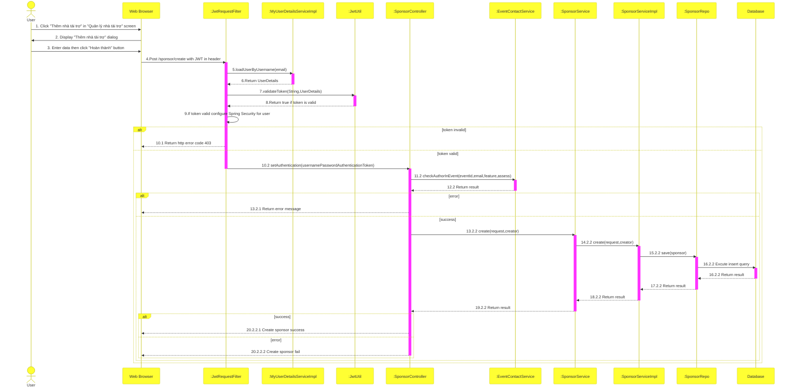
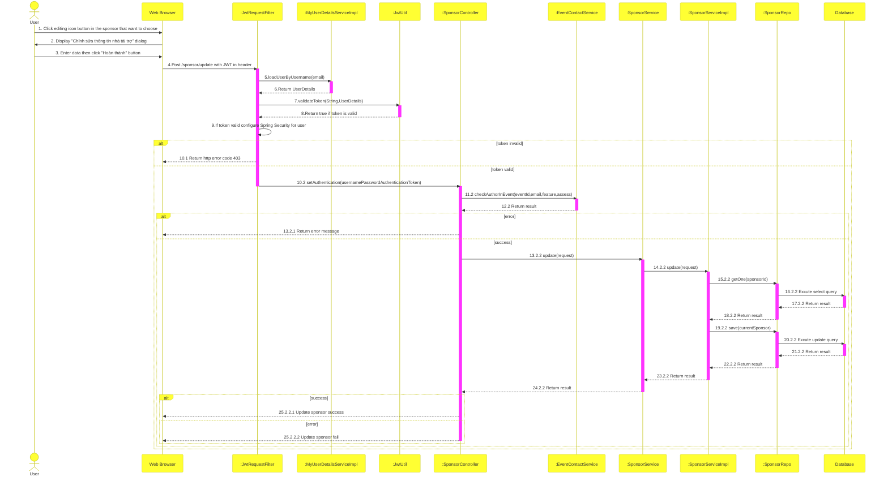

Create Sponsor

```mermaid
%%{init: {'theme': 'base', 'themeVariables': {'primaryColor': '#FFFF33'}}}%%
sequenceDiagram
    actor User
    participant Web Browser
    participant #58;JwtRequestFilter
    participant #58;MyUserDetailsServiceImpl
    participant #58;JwtUtil
    participant #58;SponsorController
    participant #58;EventContactService    
    participant #58;SponsorService
    participant #58;SponsorServiceImpl
    participant #58;SponsorRepo
    participant Database
    User->>Web Browser: 1. Click "Thêm nhà tài trợ" in "Quản lý nhà tài trợ" screen
    Web Browser->>User: 2. Display "Thêm nhà tài trợ" dialog    
    User->>Web Browser: 3. Enter data then click "Hoàn thành" button    
    Web Browser->>#58;JwtRequestFilter: 4.Post /sponsor/create with JWT in header
    activate #58;JwtRequestFilter
    #58;JwtRequestFilter->>#58;MyUserDetailsServiceImpl: 5.loadUserByUsername(email)
    activate #58;MyUserDetailsServiceImpl
    #58;MyUserDetailsServiceImpl-->>#58;JwtRequestFilter: 6.Return UserDetails
    deactivate #58;MyUserDetailsServiceImpl
    #58;JwtRequestFilter->>#58;JwtUtil: 7.validateToken(String,UserDetails)
    activate #58;JwtUtil
    #58;JwtUtil-->>#58;JwtRequestFilter: 8.Return true if token is valid
    deactivate #58;JwtUtil
    #58;JwtRequestFilter->>#58;JwtRequestFilter: 9.If token valid configure Spring Security for user 
    alt token invalid
    #58;JwtRequestFilter-->>Web Browser:10.1 Return http error code 403
    else token valid
    #58;JwtRequestFilter->>#58;SponsorController: 10.2 setAuthentication(usernamePasswordAuthenticationToken);
    deactivate #58;JwtRequestFilter     
    activate #58;SponsorController
    #58;SponsorController->>#58;EventContactService: 11.2 checkAuthorInEvent(eventId,email,feature,assess);
    activate #58;EventContactService   
    #58;EventContactService-->>#58;SponsorController:12.2 Return result
    deactivate #58;EventContactService
    alt error
		#58;SponsorController-->>Web Browser: 13.2.1 Return error message
	else success		
    #58;SponsorController->>#58;SponsorService: 13.2.2 create(request,creator);
    activate #58;SponsorService       
    #58;SponsorService->>#58;SponsorServiceImpl: 14.2.2 create(request,creator);
    activate #58;SponsorServiceImpl
    #58;SponsorServiceImpl->>#58;SponsorRepo: 15.2.2 save(sponsor);
    activate #58;SponsorRepo
    #58;SponsorRepo->>Database: 16.2.2 Excute insert query    
    activate Database
    Database-->>#58;SponsorRepo: 16.2.2 Return result    
    deactivate Database
    #58;SponsorRepo-->>#58;SponsorServiceImpl: 17.2.2 Return result
    deactivate #58;SponsorRepo
    #58;SponsorServiceImpl-->>#58;SponsorService: 18.2.2 Return result
    deactivate #58;SponsorServiceImpl
    #58;SponsorService-->>#58;SponsorController: 19.2.2 Return result
    deactivate #58;SponsorService
    alt success
		#58;SponsorController-->>Web Browser: 20.2.2.1 Create sponsor success
	else error
		#58;SponsorController-->>Web Browser: 20.2.2.2 Create sponsor fail
		deactivate #58;SponsorController
	end
	end
    end
	
	
```
Update Sponsor

```mermaid
%%{init: {'theme': 'base', 'themeVariables': { 'primaryColor': '#FFFF33'}}}%%
sequenceDiagram
    actor User
    participant Web Browser
    participant #58;JwtRequestFilter
    participant #58;MyUserDetailsServiceImpl
    participant #58;JwtUtil
    participant #58;SponsorController
    participant #58;EventContactService
    participant #58;SponsorService
    participant #58;SponsorServiceImpl
    participant #58;SponsorRepo
    participant Database
    User->>Web Browser: 1. Click editing icon button in the sponsor that want to choose    
    Web Browser->>User: 2. Display "Chỉnh sửa thông tin nhà tài trợ" dialog
    User->>Web Browser: 3. Enter data then click "Hoàn thành" button    
    Web Browser->>#58;JwtRequestFilter: 4.Post /sponsor/update with JWT in header
    activate #58;JwtRequestFilter
    #58;JwtRequestFilter->>#58;MyUserDetailsServiceImpl: 5.loadUserByUsername(email)
    activate #58;MyUserDetailsServiceImpl
    #58;MyUserDetailsServiceImpl-->>#58;JwtRequestFilter: 6.Return UserDetails
    deactivate #58;MyUserDetailsServiceImpl
    #58;JwtRequestFilter->>#58;JwtUtil: 7.validateToken(String,UserDetails)
    activate #58;JwtUtil
    #58;JwtUtil-->>#58;JwtRequestFilter: 8.Return true if token is valid
    deactivate #58;JwtUtil
    #58;JwtRequestFilter->>#58;JwtRequestFilter: 9.If token valid configure Spring Security for user
     alt token invalid
    #58;JwtRequestFilter-->>Web Browser:10.1 Return http error code 403
    else token valid
    #58;JwtRequestFilter->>#58;SponsorController: 10.2 setAuthentication(usernamePasswordAuthenticationToken);   
    deactivate #58;JwtRequestFilter     
    activate #58;SponsorController
    #58;SponsorController->>#58;EventContactService: 11.2 checkAuthorInEvent(eventId,email,feature,assess);
    activate #58;EventContactService     
    #58;EventContactService-->>#58;SponsorController:12.2 Return result
    deactivate #58;EventContactService
    alt error
		#58;SponsorController-->>Web Browser: 13.2.1 Return error message
	else success		
    #58;SponsorController->>#58;SponsorService:13.2.2 update(request);
    activate #58;SponsorService        
    #58;SponsorService->>#58;SponsorServiceImpl:14.2.2 update(request);
    activate #58;SponsorServiceImpl
    #58;SponsorServiceImpl->>#58;SponsorRepo:15.2.2 getOne(sponsorId);
    activate #58;SponsorRepo
    #58;SponsorRepo->>Database:16.2.2 Excute select query
    activate Database
    Database-->>#58;SponsorRepo:17.2.2 Return result    
    deactivate Database
    #58;SponsorRepo-->>#58;SponsorServiceImpl:18.2.2 Return result
    deactivate #58;SponsorRepo
    
    #58;SponsorServiceImpl->>#58;SponsorRepo: 19.2.2 save(currentSponsor);    
    activate #58;SponsorRepo
    #58;SponsorRepo->>Database: 20.2.2 Excute update query    
    activate Database
    Database-->>#58;SponsorRepo: 21.2.2 Return result    
    deactivate Database
    #58;SponsorRepo-->>#58;SponsorServiceImpl: 22.2.2 Return result
    deactivate #58;SponsorRepo
    #58;SponsorServiceImpl-->>#58;SponsorService: 23.2.2 Return result
    deactivate #58;SponsorServiceImpl
    #58;SponsorService-->>#58;SponsorController: 24.2.2 Return result
    deactivate #58;SponsorService
    alt success
		#58;SponsorController-->>Web Browser: 25.2.2.1 Update sponsor success
	else error
		#58;SponsorController-->>Web Browser: 25.2.2.2 Update sponsor fail
		deactivate #58;SponsorController
	end
	end
	end
	
	
	
```
