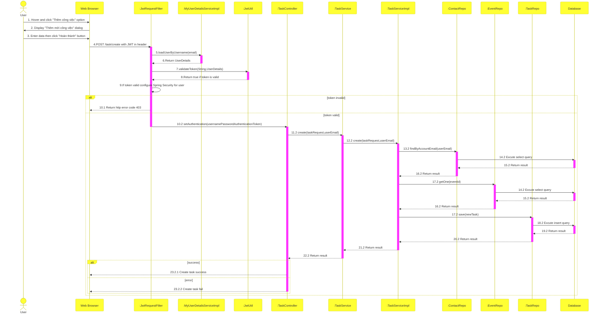
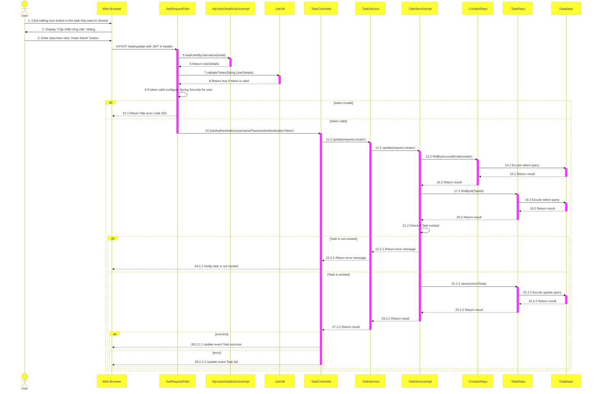
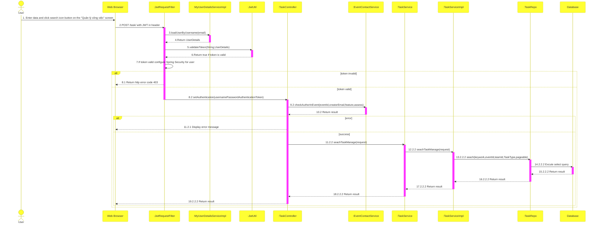

Create Task

```mermaid
%%{init: {'theme': 'base', 'themeVariables': {'primaryColor': '#FFFF33'}}}%%
sequenceDiagram
    actor User
    participant Web Browser
    participant #58;JwtRequestFilter
    participant #58;MyUserDetailsServiceImpl
    participant #58;JwtUtil
    participant #58;TaskController       
    participant #58;TaskService
    participant #58;TaskServiceImpl
    participant #58;ContactRepo
    participant #58;EventRepo
    participant #58;TaskRepo
    participant Database
    User->>Web Browser: 1. Hover and click "Thêm công việc" option
    Web Browser->>User: 2. Display "Thêm mới công việc" dialog    
    User->>Web Browser: 3. Enter data then click "Hoàn thành" button    
    Web Browser->>#58;JwtRequestFilter: 4.POST /task/create with JWT in header
    activate #58;JwtRequestFilter
    #58;JwtRequestFilter->>#58;MyUserDetailsServiceImpl: 5.loadUserByUsername(email)
    activate #58;MyUserDetailsServiceImpl
    #58;MyUserDetailsServiceImpl-->>#58;JwtRequestFilter: 6.Return UserDetails
    deactivate #58;MyUserDetailsServiceImpl
    #58;JwtRequestFilter->>#58;JwtUtil: 7.validateToken(String,UserDetails)
    activate #58;JwtUtil
    #58;JwtUtil-->>#58;JwtRequestFilter: 8.Return true if token is valid
    deactivate #58;JwtUtil
    #58;JwtRequestFilter->>#58;JwtRequestFilter: 9.If token valid configure Spring Security for user 
    alt token invalid
    #58;JwtRequestFilter-->>Web Browser:10.1 Return http error code 403
    else token valid
    #58;JwtRequestFilter->>#58;TaskController: 10.2 setAuthentication(usernamePasswordAuthenticationToken);
    deactivate #58;JwtRequestFilter     
    activate #58;TaskController    	
    #58;TaskController->>#58;TaskService: 11.2 create(taskRequest,userEmail);
    activate #58;TaskService       
    #58;TaskService->>#58;TaskServiceImpl: 12.2 create(taskRequest,userEmail);
    activate #58;TaskServiceImpl
    #58;TaskServiceImpl->>#58;ContactRepo:13.2 findByAccountEmail(userEmail)
    activate #58;ContactRepo
    #58;ContactRepo->>Database:14.2 Excute select query
    activate Database
    Database-->>#58;ContactRepo:15.2 Return result
    deactivate Database
    #58;ContactRepo-->>#58;TaskServiceImpl:16.2 Return result
    deactivate #58;ContactRepo
    #58;TaskServiceImpl->>#58;EventRepo:17.2 getOne(eventId)
    activate #58;EventRepo
    #58;EventRepo->>Database:14.2 Excute select query
    activate Database
    Database-->>#58;EventRepo:15.2 Return result
    deactivate Database
    #58;EventRepo-->>#58;TaskServiceImpl:16.2 Return result
    deactivate #58;EventRepo
    #58;TaskServiceImpl->>#58;TaskRepo: 17.2 save(newTask);
    activate #58;TaskRepo
    #58;TaskRepo->>Database: 18.2 Excute insert query    
    activate Database
    Database-->>#58;TaskRepo: 19.2 Return result    
    deactivate Database
    #58;TaskRepo-->>#58;TaskServiceImpl: 20.2 Return result
    deactivate #58;TaskRepo
    #58;TaskServiceImpl-->>#58;TaskService: 21.2 Return result
    deactivate #58;TaskServiceImpl
    #58;TaskService-->>#58;TaskController: 22.2 Return result
    deactivate #58;TaskService
    alt success
		#58;TaskController-->>Web Browser: 23.2.1 Create task success
	else error
		#58;TaskController-->>Web Browser: 23.2.2 Create task fail
		deactivate #58;TaskController
	end
	end
    
	
	
```
Update Task

```mermaid
%%{init: {'theme': 'base', 'themeVariables': { 'primaryColor': '#FFFF33'}}}%%
sequenceDiagram
    actor User
    participant Web Browser
    participant #58;JwtRequestFilter
    participant #58;MyUserDetailsServiceImpl
    participant #58;JwtUtil
    participant #58;TaskController    
    participant #58;TaskService
    participant #58;TaskServiceImpl
    participant #58;ContactRepo
    participant #58;TaskRepo
    participant Database
    User->>Web Browser: 1. Click editing icon button in the task that want to choose    
    Web Browser->>User: 2. Display "Cập nhật công việc" dialog
    User->>Web Browser: 3. Enter data then click "Hoàn thành" button    
    Web Browser->>#58;JwtRequestFilter: 4.POST /task/update with JWT in header
    activate #58;JwtRequestFilter
    #58;JwtRequestFilter->>#58;MyUserDetailsServiceImpl: 5.loadUserByUsername(email)
    activate #58;MyUserDetailsServiceImpl
    #58;MyUserDetailsServiceImpl-->>#58;JwtRequestFilter: 6.Return UserDetails
    deactivate #58;MyUserDetailsServiceImpl
    #58;JwtRequestFilter->>#58;JwtUtil: 7.validateToken(String,UserDetails)
    activate #58;JwtUtil
    #58;JwtUtil-->>#58;JwtRequestFilter: 8.Return true if token is valid
    deactivate #58;JwtUtil
    #58;JwtRequestFilter->>#58;JwtRequestFilter: 9.If token valid configure Spring Security for user
     alt token invalid
    #58;JwtRequestFilter-->>Web Browser:10.1 Return http error code 403
    else token valid
    #58;JwtRequestFilter->>#58;TaskController: 10.2setAuthentication(usernamePasswordAuthenticationToken);   
    deactivate #58;JwtRequestFilter     
    activate #58;TaskController    
    #58;TaskController->>#58;TaskService:11.2 update(request,creator);
    activate #58;TaskService        
    #58;TaskService->>#58;TaskServiceImpl:12.2 update(request,creator);
    activate #58;TaskServiceImpl
    #58;TaskServiceImpl->>#58;ContactRepo:13.2 findByAccountEmail(creator);
    activate #58;ContactRepo
    #58;ContactRepo->>Database:14.2 Excute select query
    activate Database
    Database-->>#58;ContactRepo:15.2 Return result    
    deactivate Database
    #58;ContactRepo-->>#58;TaskServiceImpl:16.2 Return result
    deactivate #58;ContactRepo
    #58;TaskServiceImpl->>#58;TaskRepo:17.2 findById(TaskId);
    activate #58;TaskRepo
    #58;TaskRepo->>Database:18.2 Excute select query
    activate Database
    Database-->>#58;TaskRepo:19.2 Return result    
    deactivate Database
    #58;TaskRepo-->>#58;TaskServiceImpl:20.2 Return result
    deactivate #58;TaskRepo
    #58;TaskServiceImpl->>#58;TaskServiceImpl:21.2 Check if Task existed
    alt Task is not existed
		#58;TaskServiceImpl-->>#58;TaskService: 22.2.1 Return error message
		#58;TaskService-->>#58;TaskController: 23.2.1 Return error message
		#58;TaskController-->>Web Browser: 24.2.1 Notify task is not existed 
	else Task is existed
    #58;TaskServiceImpl->>#58;TaskRepo: 22.2.2 save(currentTask);    
    activate #58;TaskRepo
    #58;TaskRepo->>Database: 23.2.2 Excute update query    
    activate Database
    Database-->>#58;TaskRepo: 24.2.2 Return result    
    deactivate Database
    #58;TaskRepo-->>#58;TaskServiceImpl: 25.2.2 Return result
    deactivate #58;TaskRepo
    #58;TaskServiceImpl-->>#58;TaskService: 26.2.2 Return result
    deactivate #58;TaskServiceImpl
    #58;TaskService-->>#58;TaskController: 27.2.2 Return result
    deactivate #58;TaskService
    alt success
		#58;TaskController-->>Web Browser: 28.2.2.1 Update event Task success
	else error
		#58;TaskController-->>Web Browser: 28.2.2.2 Update event Task fail
		deactivate #58;TaskController
	end
	end
	end
	
	
	
```

Search Task(s)

```mermaid
%%{init: {'theme': 'base', 'themeVariables': { 'primaryColor': '#FFFF33'}}}%%
sequenceDiagram
    actor User
    participant Web Browser
    participant #58;JwtRequestFilter
    participant #58;MyUserDetailsServiceImpl
    participant #58;JwtUtil
    participant #58;TaskController
    participant #58;EventContactService
    participant #58;TaskService
    participant #58;TaskServiceImpl
    participant #58;TaskRepo
    participant Database
    User->>Web Browser: 1. Enter data and click search icon button on the "Quản lý công việc" screen    
    Web Browser->>#58;JwtRequestFilter: 2.POST /task/ with JWT in header
    activate #58;JwtRequestFilter
    #58;JwtRequestFilter->>#58;MyUserDetailsServiceImpl: 3.loadUserByUsername(email)
    activate #58;MyUserDetailsServiceImpl
    #58;MyUserDetailsServiceImpl-->>#58;JwtRequestFilter: 4.Return UserDetails
    deactivate #58;MyUserDetailsServiceImpl
    #58;JwtRequestFilter->>#58;JwtUtil: 5.validateToken(String,UserDetails)
    activate #58;JwtUtil
    #58;JwtUtil-->>#58;JwtRequestFilter: 6.Return true if token is valid
    deactivate #58;JwtUtil
    #58;JwtRequestFilter->>#58;JwtRequestFilter: 7.If token valid configure Spring Security for user
     alt token invalid
    #58;JwtRequestFilter-->>Web Browser: 8.1 Return http error code 403
    else token valid
    #58;JwtRequestFilter->>#58;TaskController: 8.2 setAuthentication(usernamePasswordAuthenticationToken);
    deactivate #58;JwtRequestFilter     
    activate #58;TaskController
    #58;TaskController->>#58;EventContactService: 9.2 checkAuthorInEvent(eventId,creatorEmail,feature,assess);
    activate #58;EventContactService    
    #58;EventContactService-->>#58;TaskController:10.2 Return result
    deactivate #58;EventContactService
    alt error
		#58;TaskController-->>Web Browser: 11.2.1 Display error message
	else success		
    #58;TaskController->>#58;TaskService: 11.2.2 seachTaskManage(request);
    activate #58;TaskService       
    #58;TaskService->>#58;TaskServiceImpl: 12.2.2 seachTaskManage(request);
    activate #58;TaskServiceImpl    	
    #58;TaskServiceImpl->>#58;TaskRepo: 13.2.2.2 seach(keywork,eventId,teamId,TaskType,pageable);
    activate #58;TaskRepo     
    #58;TaskRepo->>Database: 14.2.2.2 Excute select query    
    activate Database
    Database-->>#58;TaskRepo: 15.2.2.2 Return result    
    deactivate Database
    #58;TaskRepo-->>#58;TaskServiceImpl: 16.2.2.2 Return result
    deactivate #58;TaskRepo
    #58;TaskServiceImpl-->>#58;TaskService: 17.2.2.2 Return result
    deactivate #58;TaskServiceImpl
    #58;TaskService-->>#58;TaskController: 18.2.2.2 Return result
    deactivate #58;TaskService    
	#58;TaskController-->>Web Browser: 19.2.2.2 Return result
    deactivate #58;TaskController
	end	 
	end 
	
```

