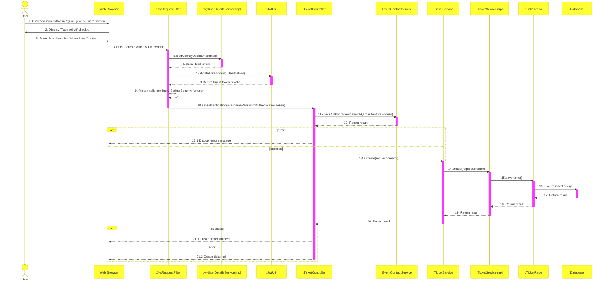
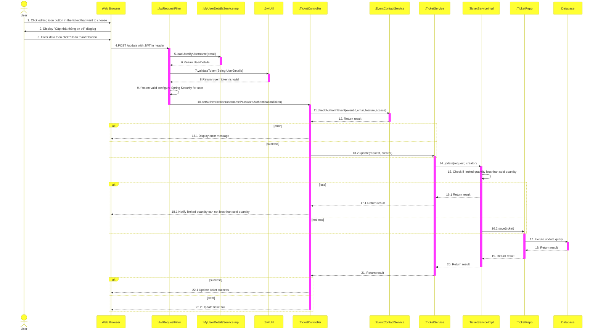
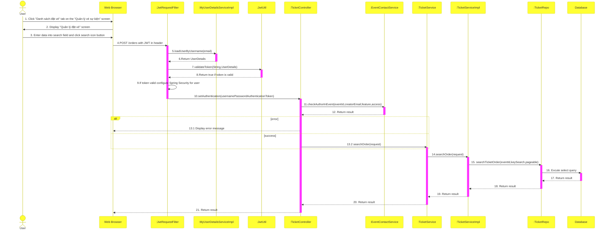

Create Ticket

```mermaid
%%{init: {'theme': 'base', 'themeVariables': { 'primaryColor': '#FFFF33'}}}%%
sequenceDiagram
    actor User
    participant Web Browser
    participant #58;JwtRequestFilter
    participant #58;MyUserDetailsServiceImpl
    participant #58;JwtUtil
    participant #58;TicketController
    participant #58;EventContactService    
    participant #58;TicketService
    participant #58;TicketServiceImpl
    participant #58;TicketRepo
    participant Database
    User->>Web Browser: 1. Click add icon button in "Quản lý vé sự kiện" screen
    Web Browser->>User: 2. Display "Tạo mới vé" diaglog
    User->>Web Browser: 3. Enter data then click "Hoàn thành" button    
    Web Browser->>#58;JwtRequestFilter: 4.POST /create with JWT in header
    activate #58;JwtRequestFilter
    #58;JwtRequestFilter->>#58;MyUserDetailsServiceImpl: 5.loadUserByUsername(email)
    activate #58;MyUserDetailsServiceImpl
    #58;MyUserDetailsServiceImpl-->>#58;JwtRequestFilter: 6.Return UserDetails
    deactivate #58;MyUserDetailsServiceImpl
    #58;JwtRequestFilter->>#58;JwtUtil: 7.validateToken(String,UserDetails)
    activate #58;JwtUtil
    #58;JwtUtil-->>#58;JwtRequestFilter: 8.Return true if token is valid
    deactivate #58;JwtUtil
    #58;JwtRequestFilter->>#58;JwtRequestFilter: 9.If token valid configure Spring Security for user    
    #58;JwtRequestFilter->>#58;TicketController: 10.setAuthentication(usernamePasswordAuthenticationToken);
    deactivate #58;JwtRequestFilter     
    activate #58;TicketController
    #58;TicketController->>#58;EventContactService: 11.checkAuthorInEvent(eventId,email,feature,access);
    activate #58;EventContactService   
    #58;EventContactService-->>#58;TicketController:12. Return result
    deactivate #58;EventContactService
     alt error
		#58;TicketController-->>Web Browser: 13.1 Display error message
	else success		
    #58;TicketController->>#58;TicketService: 13.2 create(request,creator);
    activate #58;TicketService    
    end    
    #58;TicketService->>#58;TicketServiceImpl: 14.create(request,creator);
    activate #58;TicketServiceImpl
    #58;TicketServiceImpl->>#58;TicketRepo: 15.save(ticket);
    activate #58;TicketRepo
    #58;TicketRepo->>Database: 16. Excute insert query    
    activate Database
    Database-->>#58;TicketRepo: 17. Return result    
    deactivate Database
    #58;TicketRepo-->>#58;TicketServiceImpl: 18. Return result
    deactivate #58;TicketRepo
    #58;TicketServiceImpl-->>#58;TicketService: 19. Return result
    deactivate #58;TicketServiceImpl
    #58;TicketService-->>#58;TicketController: 20. Return result
    deactivate #58;TicketService
    alt success
		#58;TicketController-->>Web Browser: 21.1 Create ticket success
	else error
		#58;TicketController-->>Web Browser: 21.2 Create ticket fail
		deactivate #58;TicketController
	end
	
	
```
Update Ticket

```mermaid
%%{init: {'theme': 'base', 'themeVariables': { 'primaryColor': '#FFFF33'}}}%%
sequenceDiagram
    actor User
    participant Web Browser
    participant #58;JwtRequestFilter
    participant #58;MyUserDetailsServiceImpl
    participant #58;JwtUtil
    participant #58;TicketController
    participant #58;EventContactService
    participant #58;TicketService
    participant #58;TicketServiceImpl
    participant #58;TicketRepo
    participant Database
    User->>Web Browser: 1. Click editing icon button in the ticket that want to choose    
    Web Browser->>User: 2. Display "Cập nhật thông tin vé" diaglog
    User->>Web Browser: 3. Enter data then click "Hoàn thành" button    
    Web Browser->>#58;JwtRequestFilter: 4.POST /update with JWT in header
    activate #58;JwtRequestFilter
    #58;JwtRequestFilter->>#58;MyUserDetailsServiceImpl: 5.loadUserByUsername(email)
    activate #58;MyUserDetailsServiceImpl
    #58;MyUserDetailsServiceImpl-->>#58;JwtRequestFilter: 6.Return UserDetails
    deactivate #58;MyUserDetailsServiceImpl
    #58;JwtRequestFilter->>#58;JwtUtil: 7.validateToken(String,UserDetails)
    activate #58;JwtUtil
    #58;JwtUtil-->>#58;JwtRequestFilter: 8.Return true if token is valid
    deactivate #58;JwtUtil
    #58;JwtRequestFilter->>#58;JwtRequestFilter: 9.If token valid configure Spring Security for user    
    #58;JwtRequestFilter->>#58;TicketController: 10.setAuthentication(usernamePasswordAuthenticationToken);
    deactivate #58;JwtRequestFilter     
    activate #58;TicketController
    #58;TicketController->>#58;EventContactService: 11.checkAuthorInEvent(eventId,email,feature,access);
    activate #58;EventContactService    
    #58;EventContactService-->>#58;TicketController:12. Return result
    deactivate #58;EventContactService
     alt error
		#58;TicketController-->>Web Browser: 13.1 Display error message
	else success		
    #58;TicketController->>#58;TicketService: 13.2 update(request, creator);
    activate #58;TicketService    
    end    
    #58;TicketService->>#58;TicketServiceImpl: 14.update(request, creator);
    activate #58;TicketServiceImpl
    #58;TicketServiceImpl->>#58;TicketServiceImpl:15. Check if limited quantity less than sold quantity
    alt less 
		#58;TicketServiceImpl-->>#58;TicketService: 16.1 Return result
		#58;TicketService-->>#58;TicketController: 17.1 Return result
		#58;TicketController-->>Web Browser: 18.1 Notify limited quantity can not less than sold quantity
	else not less
    #58;TicketServiceImpl->>#58;TicketRepo: 16.2 save(ticket);
    end
    activate #58;TicketRepo
    #58;TicketRepo->>Database: 17. Excute update query    
    activate Database
    Database-->>#58;TicketRepo: 18. Return result    
    deactivate Database
    #58;TicketRepo-->>#58;TicketServiceImpl: 19. Return result
    deactivate #58;TicketRepo
    #58;TicketServiceImpl-->>#58;TicketService: 20. Return result
    deactivate #58;TicketServiceImpl
    #58;TicketService-->>#58;TicketController: 21. Return result
    deactivate #58;TicketService
    alt success
		#58;TicketController-->>Web Browser: 22.1 Update ticket success
	else error
		#58;TicketController-->>Web Browser: 22.2 Update ticket fail
		deactivate #58;TicketController
	end
	
	
```
Search Ticket Order(s)

```mermaid
%%{init: {'theme': 'base', 'themeVariables': { 'primaryColor': '#FFFF33'}}}%%
sequenceDiagram
    actor User
    participant Web Browser
    participant #58;JwtRequestFilter
    participant #58;MyUserDetailsServiceImpl
    participant #58;JwtUtil
    participant #58;TicketController
    participant #58;EventContactService
    participant #58;TicketService
    participant #58;TicketServiceImpl
    participant #58;TicketRepo
    participant Database
    User->>Web Browser: 1. Click "Danh sách đặt vé" tab on the "Quản lý vé sự kiện" screen 
    Web Browser->>User: 2. Display "Quản lý đặt vé" screen
    User->>Web Browser: 3. Enter data into search field and click search icon button    
    Web Browser->>#58;JwtRequestFilter: 4.POST /orders with JWT in header
    activate #58;JwtRequestFilter
    #58;JwtRequestFilter->>#58;MyUserDetailsServiceImpl: 5.loadUserByUsername(email)
    activate #58;MyUserDetailsServiceImpl
    #58;MyUserDetailsServiceImpl-->>#58;JwtRequestFilter: 6.Return UserDetails
    deactivate #58;MyUserDetailsServiceImpl
    #58;JwtRequestFilter->>#58;JwtUtil: 7.validateToken(String,UserDetails)
    activate #58;JwtUtil
    #58;JwtUtil-->>#58;JwtRequestFilter: 8.Return true if token is valid
    deactivate #58;JwtUtil
    #58;JwtRequestFilter->>#58;JwtRequestFilter: 9.If token valid configure Spring Security for user    
    #58;JwtRequestFilter->>#58;TicketController: 10.setAuthentication(usernamePasswordAuthenticationToken);
    deactivate #58;JwtRequestFilter     
    activate #58;TicketController
    #58;TicketController->>#58;EventContactService: 11.checkAuthorInEvent(eventId,creatorEmail,feature,access);
    activate #58;EventContactService    
    #58;EventContactService-->>#58;TicketController:12. Return result
    deactivate #58;EventContactService
    alt error
		#58;TicketController-->>Web Browser: 13.1 Display error message
	else success		
    #58;TicketController->>#58;TicketService: 13.2 searchOrder(request);
    activate #58;TicketService    
    end    
    #58;TicketService->>#58;TicketServiceImpl: 14.searchOrder(request);
    activate #58;TicketServiceImpl    
    #58;TicketServiceImpl->>#58;TicketRepo: 15. searchTicketOrder(eventId,keySearch,pageable);
    activate #58;TicketRepo     
    #58;TicketRepo->>Database: 16. Excute select query    
    activate Database
    Database-->>#58;TicketRepo: 17. Return result    
    deactivate Database
    #58;TicketRepo-->>#58;TicketServiceImpl: 18. Return result
    deactivate #58;TicketRepo
    #58;TicketServiceImpl-->>#58;TicketService: 19. Return result
    deactivate #58;TicketServiceImpl
    #58;TicketService-->>#58;TicketController: 20. Return result
    deactivate #58;TicketService    
	#58;TicketController-->>Web Browser: 21. Return result 
	deactivate #58;TicketController
	
	
```


​	

```
```